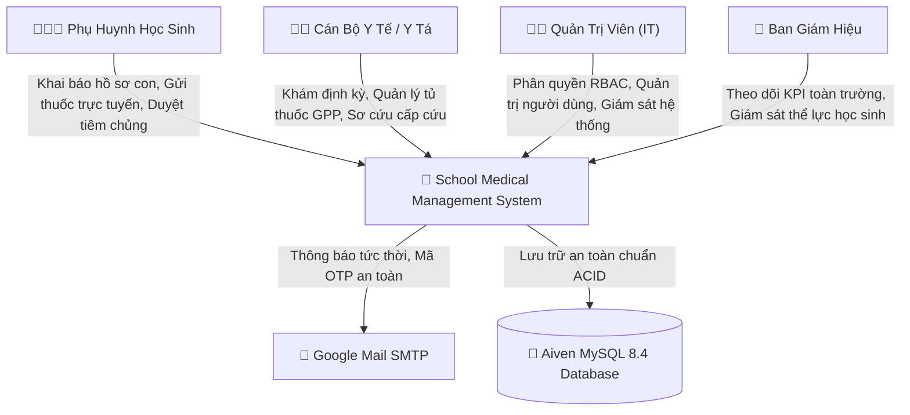
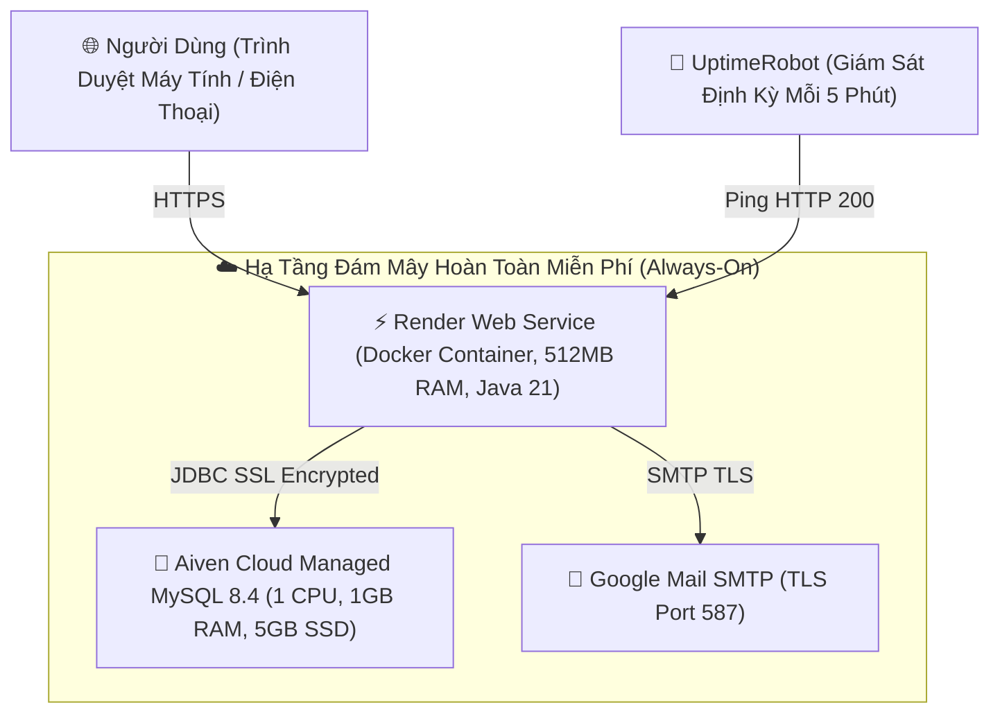

<div align="center">

# 🏥 SCHOOL MEDICAL MANAGEMENT SYSTEM
### Hệ Thống Quản Lý Y Tế Học Đường Toàn Diện — Nền Tảng Chuyển Đổi Số Giáo Dục

[-ED8B00?style=for-the-badge&logo=openjdk&logoColor=white)](https://openjdk.org/projects/jdk/21/)
[](https://spring.io/projects/spring-boot)
[](https://spring.io/projects/spring-security)
[-4479A1?style=for-the-badge&logo=mysql&logoColor=white)](https://www.mysql.com/)
[](https://school-medical-management-system-c6m8.onrender.com/yte/)
[](#-8-hệ-thống-kiểm-thử-tự-động-automated-testing-suite)
[](LICENSE)

<br/>

**Giải pháp công nghệ số hóa 100% công tác y tế học đường, kết nối liền mạch đa chiều:**  
🏫 **Nhà trường** &bull; 👩‍⚕️ **Cán bộ Y tế** &bull; 👨‍👩‍👦 **Phụ huynh học sinh** &bull; 👨‍💼 **Ban Giám hiệu**

[🌐 Trải Nghiệm Trực Tuyến (Live Demo)](#-2-trải-nghiệm-trực-tuyến-live-demo-247) &bull;
[🏗️ Kiến Trúc Hệ Thống](#-4-kiến-trúc-hệ-thống-system-architecture) &bull;
[✨ Phân Hệ Nghiệp Vụ](#-5-các-phân-hệ-nghiệp-vụ-chi-tiết) &bull;
[🧪 Kiểm Thử 135 Tests](#-8-hệ-thống-kiểm-thử-tự-động-automated-testing-suite) &bull;
[🚀 Cài Đặt Cục Bộ](#-10-hướng-dẫn-cài-đặt--vận-hành-cục-bộ-local-setup) &bull;
[📖 Cẩm Nang Sử Dụng](docs/USER_GUIDE.md)

</div>

---

## 📑 MỤC LỤC TỔNG QUAN

1. [Tổng Quan & Bài Toán Nghiệp Vụ](#-1-tổng-quan--bài-toán-nghiệp-vụ-problem--solution)
2. [Trải Nghiệm Trực Tuyến (Live Demo 24/7)](#-2-trải-nghiệm-trực-tuyến-live-demo-247)
3. [Tài Khoản Thử Nghiệm Theo Phân Quyền](#-3-tài-khoản-thử-nghiệm-demo-accounts)
4. [Kiến Trúc Hệ Thống (System Architecture)](#-4-kiến-trúc-hệ-thống-system-architecture)
5. [Các Phân Hệ Nghiệp Vụ Chi Tiết (Core Modules)](#-5-các-phân-hệ-nghiệp-vụ-chi-tiết)
6. [Giao Diện Đồ Họa 3D & Trải Nghiệm Người Dùng (Modern 3D UI)](#-6-giao-diện-đồ-họa-3d--trải-nghiệm-người-dùng)
7. [Bảng Công Nghệ Sử Dụng (Tech Stack)](#-7-bảng-công-nghệ-sử-dụng-technology-stack)
8. [Hệ Thống Kiểm Thử Tự Động (135/135 Tests PASS)](#-8-hệ-thống-kiểm-thử-tự-động-automated-testing-suite)
9. [Cơ Sở Dữ Liệu & Ràng Buộc Dữ Liệu (21 Bảng CSDL)](#-9-cơ-sở-dữ-liệu--thực-thể-database-schema)
10. [Hướng Dẫn Cài Đặt & Vận Hành Cục Bộ (Local Setup)](#-10-hướng-dẫn-cài-đặt--vận-hành-cục-bộ-local-setup)
11. [Mô Hình Triển Khai Đám Mây & Giữ Ấm 24/7](#-11-mô-hình-triển-khai-đám-mây-cloud-infrastructure)
12. [Bảo Mật & Tiêu Chuẩn Kỹ Thuật (Security Hygiene)](#-12-tiêu-chuẩn-bảo-mật--an-toàn-thông-tin)
13. [Trung Tâm Tài Liệu Dự Án (Documentation Hub)](#-13-trung-tâm-tài-liệu-dự-án-documentation-hub)
14. [Lộ Trình Phát Triển & Trạng Thái Hoàn Thiện (Roadmap)](#-14-lộ-trình-phát-triển--trạng-thái-hoàn-thiện)
15. [Tác Giả & Bản Quyền (Author & License)](#-15-tác-giả--bản-quyền-author--license)

---

## 🎯 1. Tổng Quan & Bài Toán Nghiệp Vụ (Problem & Solution)

### Bối Cảnh Thực Tế Tại Các Trường Học
Trong môi trường giáo dục phổ thông hiện nay, công tác chăm sóc sức khỏe ban đầu cho học sinh vẫn chủ yếu vận hành theo phương thức truyền thống:
* 📑 **Hồ sơ bệnh án phân tán:** Sổ khám sức khỏe định kỳ và phiếu tiêm chủng bằng giấy dễ rách nát, thất lạc, gây khó khăn cho việc tra cứu tiền sử dị ứng hoặc bệnh mãn tính của học sinh.
* 💊 **Rủi ro dùng thuốc sai liều:** Phụ huynh gửi thuốc cho con uống tại lớp thông qua dặn dò miệng hoặc mẩu giấy note sơ sài, tiềm ẩn nguy cơ nhầm lẫn liều lượng và giờ uống.
* ⏳ **Phản hồi chậm khi xin ý kiến:** Việc phát phiếu giấy xin ý kiến tiêm chủng vaccine hay khám tổng quát có tỷ lệ thu hồi thấp, cán bộ y tế tốn nhiều ngày tổng hợp thủ công.
* 🚨 **Thiếu số liệu tức thời:** Ban Giám hiệu không thể giám sát bức tranh sức khỏe toàn trường theo thời gian thực (số ca tai nạn học đường, dịch cúm mùa, tỷ lệ thừa cân/cận thị).

### Giải Pháp Đột Phá Của School Medical Management System
Hệ thống ra đời như một **nền tảng y tế số hóa tập trung**, cung cấp giải pháp khép kín từ khâu thu thập thông tin, phê duyệt trực tuyến, quản lý kho dược phẩm, cho đến ghi nhận sơ cứu và lập báo cáo y khoa đạt chuẩn Bộ Y Tế.



---

## 🌐 2. Trải Nghiệm Trực Tuyến (Live Demo 24/7)

Hệ thống được đóng gói container hóa Docker và triển khai thực tế trên nền tảng đám mây, tích hợp cơ chế **Keep-Alive 24/7** đảm bảo trang web luôn thức và phản hồi dưới 1 giây:

> [!TIP]
> **ĐƯỜNG DẪN TRUY CẬP TRỰC TIẾP:**
> * 🏠 **Trang Chủ (Giao diện 3D & Scroll Reveal):** [https://school-medical-management-system-c6m8.onrender.com/yte/](https://school-medical-management-system-c6m8.onrender.com/yte/)
> * 🔐 **Cổng Đăng Nhập Hệ Thống:** [https://school-medical-management-system-c6m8.onrender.com/yte/login](https://school-medical-management-system-c6m8.onrender.com/yte/login)
> * 📩 **Quên Mật Khẩu (Xác thực OTP Email thật):** [https://school-medical-management-system-c6m8.onrender.com/yte/forgot-password](https://school-medical-management-system-c6m8.onrender.com/yte/forgot-password)
> * ⚙️ **Cổng Quản Trị Hệ Thống:** [https://school-medical-management-system-c6m8.onrender.com/yte/admin/login](https://school-medical-management-system-c6m8.onrender.com/yte/admin/login)

---

## 🔑 3. Tài Khoản Thử Nghiệm (Demo Accounts)

Hệ thống hỗ trợ 4 vai trò độc lập với cơ chế bảo mật **Role-Based Access Control (RBAC)**:

| Vai trò (Role) | Cổng truy cập | Tên đăng nhập / SĐT | Mật khẩu mẫu | Trách nhiệm & Quyền hạn |
| :--- | :--- | :--- | :--- | :--- |
| **Quản trị viên (Admin)** | `/yte/admin/login` | `admin` | `admin` *(hoặc `123456`)* | Toàn quyền cấu hình, quản lý tài khoản, xem Dashboard KPI toàn trường |
| **Y tá học đường (Nurse)**| `/yte/login` | `0977112234` | `123456` | Lập lịch khám, tiêm chủng, quản lý tủ thuốc, tiếp nhận gửi thuốc, sơ cấp cứu |
| **Phụ huynh (Parent)** | `/yte/login` | `0912345671` | `123456` | Xem hồ sơ con, duyệt/từ chối phiếu khám/tiêm, gửi đơn thuốc dặn dò |
| **Ban Giám Hiệu (Manager)**| `/yte/login` | `0988112233` | `123456` | Giám sát danh sách lớp, tình hình dịch bệnh và thể lực học sinh |

*(Để tăng tính bảo mật, toàn bộ người dùng thông thường đăng nhập bằng số điện thoại 10 chữ số, riêng Quản trị viên sử dụng cổng đăng nhập an ninh chuyên biệt tại `/admin/login`)*.

---

## 🏗️ 4. Kiến Trúc Hệ Thống (System Architecture)

Dự án áp dụng mô hình kiến trúc chuẩn **Modular Monolith (Package-by-Feature)** kết hợp phân lớp nghiêm ngặt (Controller $\rightarrow$ Service $\rightarrow$ Repository $\rightarrow$ Entity $\rightarrow$ DTO $\rightarrow$ Mapper):

```text
src/main/java/com/medical/schoolMedical/
├── common/                  # Thành phần dùng chung toàn ứng dụng
│   ├── controllers/         # HomeController, ErrorController, CustomErrorPage
│   └── schedulers/          # Cronjobs tự động quét phiếu quá hạn (ConsentStatusScheduler)
├── enums/                   # Enums nghiệp vụ (Role, Gender, BloodType, ConsentStatus, Severity...)
├── exceptions/              # Bắt lỗi toàn cục (GlobalExceptionHandler, BusinessException, ErrorCode)
├── security/                # Spring Security 6, CustomUserDetails, CustomSuccessHandler
├── util/                    # Tiện ích bổ trợ (DateTimeUtils, ValidationUtil, TextSanitizer)
└── modules/                 # 8 Lát cắt nghiệp vụ độc lập (Bounded Contexts)
    ├── auth/                # Xác thực, phân quyền, cấp phát token OTP, Email Service
    ├── user_management/     # Quản lý User, Student, Parent, Nurse, Admin, Manager
    ├── pharmacy/            # Quản lý tủ thuốc GPP, vật tư y tế, thuốc phụ huynh gửi
    ├── healthcheck/         # Lập lịch khám, gửi phiếu đồng ý, ghi nhận kết quả, xuất POI Excel
    ├── vaccination/         # Lập kế hoạch tiêm chủng, sổ tiêm chủng, theo dõi phản ứng
    ├── medical_event/       # Xử lý sự cố y tế, sơ cấp cứu, tự động khấu trừ thuốc/vật tư
    ├── health_record/       # Hồ sơ sức khỏe học sinh, bệnh nền, dị ứng, xuất Thẻ Y Tế PDF
    └── consultation/        # Đăng ký & điều phối lịch hẹn tư vấn tâm lý/sức khỏe
```

---

## ✨ 5. Các Phân Hệ Nghiệp Vụ Chi Tiết

```mermaid
graph LR
    subgraph NurseModule["👩‍⚕️ Phân Hệ Y Tá Học Đường"]
        HC["Khám Sức Khỏe Định Kỳ"]
        VC["Kế Hoạch Tiêm Chủng"]
        ME["Sơ Cấp Cứu Học Đường"]
        PH["Quản Lý Tủ Thuốc GPP"]
        SM["Tiếp Nhận Thuốc Gửi"]
    end

    subgraph ParentModule["👨‍👩‍👦 Phân Hệ Phụ Huynh"]
        HR["Hồ Sơ Sức Khỏe Điện Tử"]
        AP["Duyệt / Từ Chối Trực Tuyến"]
        DR["Dặn Thuốc Theo Khung Giờ"]
        CO["Đặt Hẹn Tư Vấn Sức Khỏe"]
    end

    subgraph AdminModule["👨‍💼 Quản Trị & Giám Sát"]
        DB["Dashboard KPI Toàn Trường"]
        UM["Quản Lý Tài Khoản (RBAC)"]
        EX["Xuất Báo Cáo Excel & PDF"]
    end

    NurseModule <--> ParentModule
    AdminModule -. Giám sát .-> NurseModule
```



### 1. Phân Hệ Quản Lý Khám Sức Khỏe Định Kỳ (`healthcheck`)
* **Lập lịch khám theo khối/lớp:** Thiết lập thời gian, địa điểm, nội dung khám và hạn chót phản hồi.
* **Gửi phiếu xin ý kiến (`HealthCheckConsent`):** Tự động phát hành phiếu đồng thuận đến tài khoản phụ huynh kèm thông báo.
* **Nhập liệu lâm sàng chuyên sâu (`HealthCheckRecord`):** Ghi nhận đầy đủ thể lực (chiều cao, cân nặng, tự động tính chỉ số BMI), thị lực, nha khoa, tai mũi họng, tim phổi.
* **Xuất báo cáo Excel:** Sử dụng thư viện **Apache POI 5.3** xuất danh sách khám theo lớp chuẩn định dạng báo cáo giáo dục.

### 2. Phân Hệ Quản Lý Tiêm Chủng Mở Rộng (`vaccination`)
* **Kế hoạch tiêm phòng (`VaccinationSchedule`):** Lên kế hoạch tiêm các loại vaccine theo mùa hoặc theo chương trình y tế quốc gia.
* **Khảo sát tiền sử tiêm:** Thu thập thông tin dị ứng thuốc hoặc phản ứng phụ của học sinh trước đợt tiêm.
* **Sổ tiêm chủng điện tử (`VaccinationRecord`):** Ghi nhận mã lô vaccine, vị trí tiêm, cán bộ thực hiện và tình trạng theo dõi 30 phút sau tiêm.

### 3. Phân Hệ Sơ Cấp Cứu & Sự Cố Y Tế (`medical_event`)
* **Xử lý sự cố cấp tốc:** Ghi nhận sự cố phát sinh tại trường (sốt cao, ngã chấn thương, đau bụng, ngộ độc thức ăn).
* **Khấu trừ tự động dược phẩm:** Khi y tá chỉ định thuốc/băng gạc trong ca cấp cứu, hệ thống tự động trừ tồn kho tủ thuốc tương ứng, ngăn ngừa thất thoát.
* **Thông báo khẩn cấp:** Cập nhật tình trạng học sinh để phụ huynh nắm bắt tức thời.

### 4. Phân Hệ Tủ Thuốc GPP & Quản Lý Gửi Thuốc (`pharmacy`)
* **Quản lý danh mục dược phẩm (`Medicine`) & Vật tư (`MedicalSupply`):** Kiểm soát hạn dùng, đơn vị tính, số lượng tồn kho tối thiểu.
* **Tiếp nhận đơn thuốc phụ huynh gửi (`SentMedicine`):** Phụ huynh chụp toa thuốc, khai báo liều lượng và thời gian cho uống trong ngày.
* **Nhật ký uống thuốc (`SentMedicineUsage`):** Y tá điểm danh và xác nhận học sinh đã uống thuốc đúng giờ, gửi bằng chứng về ứng dụng phụ huynh.

### 5. Phân Hệ Hồ Sơ Sức Khỏe Học Sinh (`health_record`)
* **Bệnh án điện tử trọn đời:** Lưu trữ lịch sử khám thể lực qua từng năm học (Lớp 1 đến Lớp 12).
* **Xuất Thẻ Y Tế Học Sinh PDF:** Tích hợp **iText PDF** xuất thẻ y tế cá nhân phục vụ lưu trữ học bạ hoặc chuyển trường.

### 6. Phân Hệ Xác Thực & Bảo Mật OTP (`auth`)
* Quản lý phiên làm việc Stateful Session qua Cookie bảo mật `HttpOnly`.
* Quy trình lấy lại mật khẩu an toàn: Xác thực mã OTP 6 chữ số có hiệu lực 5 phút, cơ chế tự hủy token một lần dùng để triệt tiêu lỗ hổng Account Takeover.

---

## 🎨 6. Giao Diện Đồ Họa 3D & Trải Nghiệm Người Dùng

Trang chủ hệ thống được xây dựng theo phong cách **Clinical Dark Glassmorphism** kết hợp hiệu ứng không gian 3D hiện đại:

* ✨ **Scroll-Driven Reveal:** Sử dụng chuẩn API `IntersectionObserver` tối ưu GPU; khi người dùng cuộn chuột, từng phân đoạn, tiêu đề và thẻ thông tin sẽ mượt mà trượt lên từ chiều sâu trục Z với độ trễ so le (Staggered Delay từ `80ms` đến `480ms`).
* 🌟 **Interactive 3D Card Tilt:** Tích hợp bộ tính toán tọa độ vector chuột thuần Vanilla JS; khi di chuột qua các thẻ dịch vụ, thẻ sẽ nghiêng tự nhiên theo góc di chuyển (`perspective: 1000px`, `rotateX`, `rotateY`, `translateZ(12px)`).
* 💡 **Specular Glare Reflection:** Vệt sáng phản quang động chạy theo tâm con trỏ chuột trên mặt kính thẻ, tạo cảm giác bề mặt kính cường lực 3D thực thụ.
* 🛡️ **3D Floating Elements:** Các biểu tượng y tế và huy hiệu an toàn chuyển động bồng bềnh nhẹ nhàng theo chu kỳ hình sin.
* ⚡ **Zero Dependency:** Toàn bộ hiệu ứng được viết bằng CSS3 và JavaScript thuần (~3KB), không phụ thuộc thư viện bên ngoài, đạt chuẩn **60 - 120 FPS** trên cả máy tính và thiết bị di động.

---

## 💻 7. Bảng Công Nghệ Sử Dụng (Technology Stack)

| Hạng mục | Công nghệ / Thư viện | Phiên bản | Vai trò & Mục đích sử dụng |
| :--- | :--- | :--- | :--- |
| **Backend Core** | Java (OpenJDK) | **21 (LTS)** | Ngôn ngữ nền tảng, tận dụng Pattern Matching & Record Patterns |
| **Web Framework**| Spring Boot | **3.5.0** | Khung phát triển ứng dụng doanh nghiệp chính |
| **Security** | Spring Security | **6.x** | Kiểm soát phân quyền Role-Based Access Control (RBAC), CSRF |
| **ORM & Persistence**| Spring Data JPA / Hibernate | **6.6.x** | Tối ưu hóa truy vấn, kích hoạt Batch Insert `batch_size=50` |
| **Database** | MySQL Server | **8.4** | Hệ quản trị CSDL quan hệ chính (hỗ trợ SSL REQUIRED) |
| **Frontend** | Thymeleaf, HTML5, Vanilla CSS3, JS | - | Server-Side Rendering (SSR), Kiến trúc All-in-One không cần React |
| **Export Excel** | Apache POI | **5.3.0** | Xuất bảng tổng hợp kết quả khám và sổ tiêm chủng |
| **Export PDF** | iText PDF | **7.2.5** | Tạo file Thẻ khám sức khỏe điện tử định dạng PDF |
| **Email Service** | Jakarta Mail, JavaMailSender | - | Gửi mã OTP xác thực qua giao thức SMTP Gmail TLS |
| **Kiểm thử** | JUnit 5, Mockito, MockMvc, AssertJ | - | Bộ kiểm thử tự động toàn diện 135 test cases |
| **Container** | Docker Multi-Stage Build | - | Đóng gói JAR tối ưu kích thước trên nền JRE Alpine |
| **Cloud Hosting**| Render Cloud | - | Máy chủ ứng dụng chạy container 24/7 |
| **Managed DB** | Aiven Cloud | - | Dịch vụ CSDL đám mây MySQL 8.4 độc lập với 1GB RAM / 5GB SSD |
| **Keep-Alive** | UptimeRobot | - | Giám sát tự động mỗi 5 phút, giữ ứng dụng luôn thức không bao giờ sleep |

---

## 🧪 8. Hệ Thống Kiểm Thử Tự Động (Automated Testing Suite)

Hệ thống được bảo vệ bởi **135 bài kiểm thử tự động** đạt chuẩn kiểm thử chuyên nghiệp, bao quát toàn diện các tầng kiến trúc:

```text
===============================================================================
               TEST EXECUTION SUMMARY — 135 / 135 TESTS PASS
===============================================================================
 [PASS] SchoolMedicalApplicationTests (Spring Context Bootstrapping)
 [PASS] AuthControllerTest (Login, Register, OTP Validation, Password Reset)
 [PASS] EmailServiceTest (SMTP Dispatch, HTML Rendering, Error Handling)
 [PASS] OtpServiceTest (Generation, Expiry, Single-Use Invalidation, Rate Limiting)
 [PASS] HealthCheckScheduleControllerTest (Schedule CRUD, Role Permissions)
 [PASS] HealthCheckScheduleServiceTest (Validation, Overlap Checks, Notifications)
 [PASS] HealthCheckExportServiceTest (Apache POI Excel Workbook Generation)
 [PASS] MedicalEventControllerTest (First-Aid Logging, Emergency Dispatch)
 [PASS] MedicalEventServiceTest (Auto-deduction of Medicine & Supplies)
 [PASS] MedicineControllerTest (Medicine Stock Management, GPP Validation)
 [PASS] MedicineServiceTest (Inventory Tracking, Low Stock Warning)
 [PASS] AdminControllerTest (Dashboard KPIs, User Management, Soft Delete)
 [PASS] UserServiceTest (User Lifecycle, Password Hashing, RBAC Mapping)
 [PASS] VaccinationScheduleServiceTest (Vaccination Consent Tracking, Batch Notifications)
-------------------------------------------------------------------------------
 Kết quả kiểm thử: BUILD SUCCESS | 0 Failures | 0 Errors | 0 Skipped
===============================================================================
```

---

## 🐬 9. Cơ Sở Dữ Liệu & Thực Thể (Database Schema)

Cơ sở dữ liệu bao gồm **21 bảng quan hệ** chuẩn hóa bậc 3 (3NF), thiết lập đầy đủ khóa ngoại và chỉ mục tìm kiếm:

```text
┌──────────────────────────────────────── CƠ SỞ DỮ LIỆU (21 BẢNG) ────────────────────────────────────────┐
│                                                                                                         │
│  [users] ──┬──< [admins]                                                                                │
│            ├──< [managers]                                                                              │
│            ├──< [school_nurses]                                                                         │
│            └──< [parents] ───< [students] ──┬──< [health_record]                                        │
│                                             ├──< [health_check_consent] ───> [health_check_schedule]    │
│                                             ├──< [health_check_record]                                  │
│                                             ├──< [vaccination_consent] ────> [vaccination_schedule]     │
│                                             ├──< [vaccination_record]                                   │
│                                             ├──< [consultation_appointment]                             │
│                                             ├──< [medical_event] ──┬──< [medicine_used] ──> [medicine]   │
│                                             │                      └──< [supply_used] ───> [med_supply] │
│                                             └──< [sent_medicine] ──────< [sent_medicine_usage]          │
└─────────────────────────────────────────────────────────────────────────────────────────────────────────┘
```

* **users & roles:** Quản lý thông tin tài khoản đăng nhập, mật khẩu mã hóa BCrypt, trạng thái kích hoạt và cờ xóa mềm `is_deleted`.
* **students & parents:** Liên kết quan hệ cha mẹ — con cái, quản lý phân lớp và thông tin người giám hộ.
* **health_check_* & vaccination_*:** Quản lý vòng đời phiếu xin ý kiến, trạng thái đồng thuận và kết quả khám/tiêm.
* **medicine & medical_supply:** Quản lý số lượng tồn kho, đơn vị tính, hạn sử dụng.
* **medicine_used & supply_used:** Bảng trung gian ghi nhận chi tiết khấu trừ thuốc/vật tư trong từng ca sơ cứu.

---

## 🚀 10. Hướng Dẫn Cài Đặt & Vận Hành Cục Bộ (Local Setup)

### Bước 1: Chuẩn Bị Môi Trường
* **JDK:** Java Development Kit 21 trở lên (`java -version`).
* **Maven:** 3.8+ (hoặc dùng trực tiếp wrapper `.\mvnw` đi kèm).
* **MySQL:** MySQL Server 8.0+ đang chạy tại cổng `3306`.
* **Git:** Quản lý mã nguồn.

### Bước 2: Tải Mã Nguồn
```bash
git clone https://github.com/NHTung-0801/School-Medical-Management-System.git
cd School-Medical-Management-System
```

### Bước 3: Tạo Cơ Sở Dữ Liệu
Khởi chạy MySQL và tạo CSDL mới:
```sql
CREATE DATABASE db_medical CHARACTER SET utf8mb4 COLLATE utf8mb4_unicode_ci;
```

### Bước 4: Cấu Hình Môi Trường Dev (Tùy Chọn Gửi Email)
Tạo file `src/main/resources/application-dev.properties` (file này đã được bảo vệ trong `.gitignore`):
```properties
# Điền thông tin Gmail cá nhân nếu muốn thử nghiệm gửi mã OTP thật
spring.mail.username=your_email@gmail.com
spring.mail.password=your_16_char_app_password
```

### Bước 5: Chạy Ứng Dụng
* **Trên Windows (PowerShell):**
  ```powershell
  .\mvnw clean spring-boot:run
  ```
* **Trên Linux / macOS:**
  ```bash
  ./mvnw clean spring-boot:run
  ```

Sau khi màn hình hiển thị `Started SchoolMedicalApplication in X seconds`, mở trình duyệt truy cập:
👉 **`http://localhost:8080/yte`**

---

## ☁️ 11. Mô Hình Triển Khai Đám Mây (Cloud Infrastructure)

Hệ thống được thiết kế kiến trúc phân tán đám mây hiện đại, tối ưu hóa chi phí với **0 VNĐ trọn đời**:



* **Máy chủ ứng dụng (Render):** Tự động phát hiện `Dockerfile` đa tầng (Multi-Stage Build), đóng gói và triển khai ứng dụng Java 21 trên nền Alpine Linux siêu nhẹ.
* **Cơ sở dữ liệu (Aiven MySQL 8.4):** Chạy trên hạ tầng chuyên dụng của Aiven với 1GB RAM và 5GB SSD NVMe, bắt buộc mã hóa kết nối SSL (`useSSL=true`).
* **Cơ chế chống ngủ đông (UptimeRobot):** Gửi HTTP ping mỗi 5 phút tới `/yte/`, loại bỏ hoàn toàn hiện tượng ngủ đông của Render Free.

---

## 🛡️ 12. Tiêu Chuẩn Bảo Mật & An Toàn Thông Tin

1. **Không Lưu Mật Khẩu Dạng Plaintext:** 100% mật khẩu người dùng được băm một chiều bằng thuật toán **BCrypt** với độ phức tạp cao (`strength=10`).
2. **Quy Trình Quên Mật Khẩu An Toàn (Zero Trust OTP):**
   - Mã OTP 6 số sinh ngẫu nhiên bảo mật, giới hạn thời gian tồn tại trong 5 phút.
   - Khi xác thực thành công, hệ thống cấp một token đổi mật khẩu tạm thời một lần dùng duy nhất.
   - Ngăn chặn hoàn toàn lỗ hổng IDOR và chiếm quyền tài khoản (Account Takeover).
3. **Phòng Chống Tấn Công Web Phổ Biến:**
   - **SQL Injection:** Sử dụng hoàn toàn Spring Data JPA Parameterized Queries.
   - **Cross-Site Scripting (XSS):** Thymeleaf tự động mã hóa HTML Escape toàn bộ dữ liệu đầu ra.
   - **CSRF Protection:** Kích hoạt cơ chế token kiểm soát request của Spring Security.
   - **Session Hijacking:** Cookie phiên làm việc được gắn cờ `HttpOnly=true` và thời gian timeout 60 phút.
4. **Vệ Sinh Thông Tin Nhạy Cảm (Secrets Hygiene):**
   - Tuyệt đối không hardcode mật khẩu hay API keys vào Git.
   - Toàn bộ thông số kết nối CSDL và mật khẩu ứng dụng Gmail được nạp qua **Environment Variables**.

---

## 📚 13. Trung Tâm Tài Liệu Dự Án (Documentation Hub)

Toàn bộ tài liệu chi tiết của dự án được tổ chức tinh gọn tại thư mục `docs/`:

* 📖 **[docs/USER_GUIDE.md](docs/USER_GUIDE.md):** Cẩm nang hướng dẫn sử dụng chi tiết từng bước có hình ảnh minh họa cho cả 4 nhóm người dùng: **Quản Trị Viên (Admin)**, **Cán Bộ Y Tế (Nurse)**, **Phụ Huynh (Parent)** và **Ban Giám Hiệu (Manager)**.
* 🏛️ **[docs/plans/master-upgrade-plan.md](docs/plans/master-upgrade-plan.md):** Kế hoạch tổng thể và báo cáo kỹ thuật toàn diện hợp nhất từ Giai đoạn 1 đến Giai đoạn 5 (Single Source of Truth).

---

## 🛠️ 14. Lộ Trình Phát Triển & Trạng Thái Hoàn Thiện

- [x] **Giai đoạn 1 — Vá bảo mật & Sửa lỗi Runtime nghiêm trọng:** Khắc phục lỗ hổng Account Takeover, sửa lỗi đệ quy Hibernate `MultipleBagFetchException`.
- [x] **Giai đoạn 2 — Tái cấu trúc mã nguồn:** Chuyển đổi thành công sang kiến trúc **Modular Monolith** gồm 8 module độc lập, khử phụ thuộc vòng.
- [x] **Giai đoạn 3 — Tối ưu hóa hiệu năng & Ràng buộc dữ liệu:** Kích hoạt Hibernate batch insert (`batch_size=50`), bộ lọc thống kê theo năm linh hoạt, Bean Validation toàn diện.
- [x] **Giai đoạn 4 — Hệ thống kiểm thử tự động toàn diện:** Xây dựng 135 bài test tự động bao quát Controller, Service, Security, POI Excel & PDF Export (`135/135 Tests PASS`).
- [x] **Giai đoạn 5 — Tính năng nâng cao & Xuất báo cáo y khoa:** Tích hợp xuất danh sách khám/tiêm bằng Apache POI Excel và xuất Thẻ khám sức khỏe iText PDF.
- [x] **Đại tu giao diện & Không gian 3D:** Triển khai phong cách Dark Glassmorphism, hiệu ứng Scroll-Driven Reveal và 3D Interactive Card Tilt theo con trỏ chuột.
- [x] **Triển khai Đám mây 24/7:** Vận hành trơn tru trên Render Cloud + Aiven MySQL 8.4 + UptimeRobot keep-alive hoàn toàn 0 VNĐ vĩnh viễn.

---

## 👤 15. Tác Giả & Bản Quyền (Author & License)

* **Tác giả phát triển:** **NHTung-0801** ([GitHub Profile](https://github.com/NHTung-0801))
* **Email liên hệ:** `kiritohackiem05@gmail.com`
* **Dự án được phân phối dưới giấy phép:** [MIT License](LICENSE)

<br/>

<div align="center">
  <sub>Made with ❤️ by NHTung-0801. School Medical Management System — Vì một thế hệ học đường khỏe mạnh và phát triển toàn diện.</sub>
</div>