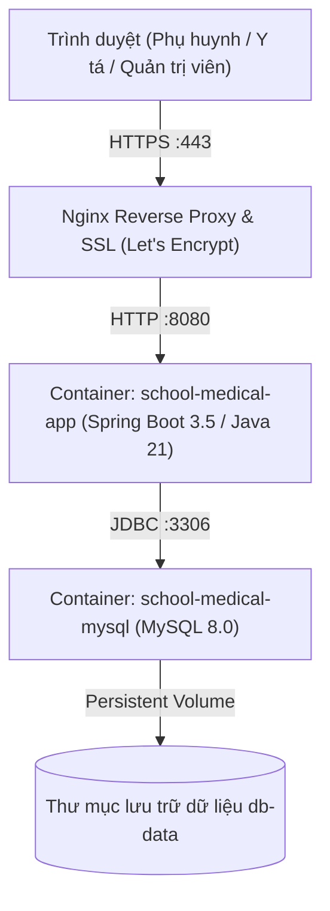

# 🚀 Hướng Dẫn Triển Khai Hệ Thống (Production Deployment Guide)

Tài liệu này cung cấp quy trình chuẩn hóa từ A-Z để đóng gói, cấu hình và triển khai dự án **School Medical Management System** trên môi trường Production (máy chủ vật lý, VPS Ubuntu/Debian hoặc hệ thống đám mây AWS, DigitalOcean, Google Cloud).

---

## 📋 1. Yêu Cầu Hạ Tầng (System Requirements)

| Thành phần | Cấu hình tối thiểu | Cấu hình khuyến nghị |
| :--- | :--- | :--- |
| **Hệ điều hành** | Ubuntu 22.04 LTS / Debian 12 / RHEL 9 | Ubuntu 24.04 LTS 64-bit |
| **CPU** | 2 vCPU | 4 vCPU trở lên |
| **RAM** | 2 GB (kèm 2GB Swap) | 4 GB - 8 GB RAM |
| **Ổ cứng (SSD)** | 20 GB trống | 50 GB NVMe SSD |
| **Phần mềm nền tảng** | Docker Engine 24.0+, Docker Compose v2 | Docker Engine bản mới nhất |

---

## ⚙️ 2. Mô Hình Kiến Trúc Triển Khai (Deployment Architecture)



---

## 🛠️ 3. Quy Trình Triển Khai Từng Bước (Step-by-Step Guide)

### Bước 1: Chuẩn bị mã nguồn trên máy chủ
Clone mã nguồn từ GitHub vào thư mục triển khai:
```bash
git clone https://github.com/NHTung-0801/School-Medical-Management-System.git /opt/school-medical
cd /opt/school-medical
```

### Bước 2: Thiết lập biến môi trường bí mật (`.env`)
Tạo file cấu hình bí mật `.env` từ file mẫu:
```bash
cp .env.example .env
nano .env
```
Cấu hình các giá trị thực tế của hệ thống:
```properties
# -------------------------------------------------------------
# CẤU HÌNH CƠ SỞ DỮ LIỆU MYSQL PRODUCTION
# -------------------------------------------------------------
MYSQL_ROOT_PASSWORD=MatKhauRootSieuKho123!@#
MYSQL_DATABASE=db_medical
MYSQL_USER=medical_user
MYSQL_PASSWORD=MatKhauMedicalApp456$%^
MYSQL_PORT=3306

# -------------------------------------------------------------
# CẤU HÌNH KẾT NỐI SPRING BOOT APP
# -------------------------------------------------------------
DB_HOST=mysql-db
DB_PORT=3306
DB_NAME=db_medical
DB_USERNAME=medical_user
DB_PASSWORD=MatKhauMedicalApp456$%^

# -------------------------------------------------------------
# DỊCH VỤ GỬI EMAIL THÔNG BÁO & OTP (Gmail App Password)
# -------------------------------------------------------------
SPRING_MAIL_USERNAME=hotro.ytehocduong@gmail.com
SPRING_MAIL_PASSWORD=xxxx-yyyy-zzzz-wwww

# -------------------------------------------------------------
# CỔNG PHỤC VỤ (APPLICATION PORT)
# -------------------------------------------------------------
APP_PORT=8080
```

### Bước 3: Khởi chạy hệ thống bằng Docker Compose
Chạy toàn bộ dịch vụ ngầm bằng một lệnh duy nhất:
```bash
docker compose up -d --build
```

Kiểm tra trạng thái các container đang chạy:
```bash
docker compose ps
```
*Kết quả kỳ vọng:* Cả hai container `school-medical-mysql` và `school-medical-app` đều ở trạng thái `Up (healthy)`.

Xem nhật ký khởi động (Live logs):
```bash
docker compose logs -f app
```

---

## 🔒 4. Cấu Hình Nginx Reverse Proxy & Chứng Chỉ SSL (HTTPS)

Để người dùng truy cập an toàn qua tên miền chính thức (ví dụ: `https://ytehocduong.edu.vn`), cấu hình Nginx làm Gateway:

### 1. Cài đặt Nginx và Certbot:
```bash
sudo apt update && sudo apt install -y nginx certbot python3-certbot-nginx
```

### 2. Cấu hình Reverse Proxy (`/etc/nginx/sites-available/ytehocduong.conf`):
```nginx
server {
    server_name ytehocduong.edu.vn;

    client_max_body_size 20M;

    location / {
        proxy_pass http://127.0.0.1:8080;
        proxy_set_header Host $host;
        proxy_set_header X-Real-IP $remote_addr;
        proxy_set_header X-Forwarded-For $proxy_add_x_forwarded_for;
        proxy_set_header X-Forwarded-Proto $scheme;

        # WebSocket support
        proxy_http_version 1.1;
        proxy_set_header Upgrade $http_upgrade;
        proxy_set_header Connection "upgrade";
    }
}
```

### 3. Kích hoạt Virtual Host & Lấy chứng chỉ SSL Let's Encrypt:
```bash
sudo ln -s /etc/nginx/sites-available/ytehocduong.conf /etc/nginx/sites-enabled/
sudo nginx -t && sudo systemctl reload nginx
sudo certbot --nginx -d ytehocduong.edu.vn
```

---

## 🩺 5. Kiểm Tra Sức Khỏe & Giám Sát (Health Check & Monitoring)

Hệ thống tích hợp sẵn Spring Boot Actuator:
1. **Health Check công khai (phục vụ Uptime Robot, Docker Probe):**
   ```bash
   curl -i http://localhost:8080/yte/actuator/health
   ```
   *Kết quả:* `HTTP/1.1 200 OK` kèm `{"status":"UP"}`.
2. **Metrics & Giám sát hiệu năng:**
   Truy cập bằng tài khoản `ADMIN` tại: `http://localhost:8080/yte/actuator/metrics`.

---

## 💾 6. Quy Trình Sao Lưu & Phục Hồi Dữ Liệu (Backup & Recovery)

### Sao lưu tự động CSDL MySQL (Daily Backup Cronjob):
Tạo file script `/opt/school-medical/backup.sh`:
```bash
#!/bin/bash
BACKUP_DIR="/opt/school-medical/backups"
TIMESTAMP=$(date +"%Y%m%d_%H%M%S")
mkdir -p $BACKUP_DIR

docker exec school-medical-mysql mysqldump -u root -pMatKhauRootSieuKho123!@# db_medical > "$BACKUP_DIR/db_medical_$TIMESTAMP.sql"
gzip "$BACKUP_DIR/db_medical_$TIMESTAMP.sql"

# Giữ lại các bản sao lưu trong vòng 30 ngày gần nhất
find $BACKUP_DIR -type f -name "*.sql.gz" -mtime +30 -delete
```
Cài đặt Crontab chạy vào 2:00 sáng hàng ngày:
```bash
0 2 * * * /bin/bash /opt/school-medical/backup.sh
```

### Phục hồi CSDL khi có sự cố (Restore):
```bash
gunzip < /opt/school-medical/backups/db_medical_20260924_020000.sql.gz | docker exec -i school-medical-mysql mysql -u root -pMatKhauRootSieuKho123!@# db_medical
```
