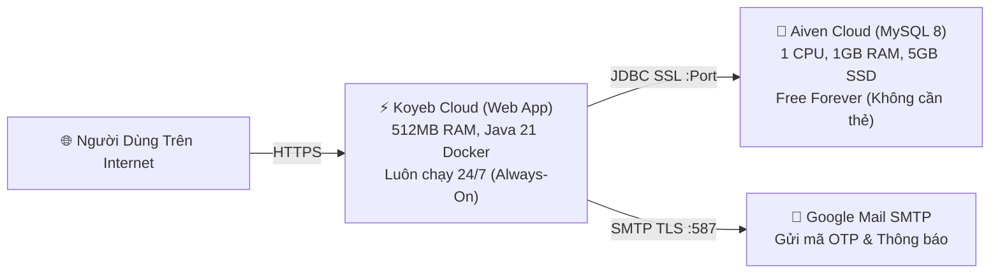

# 🚀 Hướng Dẫn Triển Khai Miễn Phí 100% Trọn Đời (Always-On Free Deployment)
## Nền Tảng: Koyeb (Web App) + Aiven (MySQL 8 Managed Database)

> **Mục tiêu:** Đưa hệ thống **School Medical Management System** lên môi trường Internet thực tế hoàn toàn **MIỄN PHÍ 100% (FREE FOREVER)**, **KHÔNG CẦN NHẬP THẺ TÍN DỤNG/VISA**, và **KHÔNG BỊ SLEEP/NGỦ ĐÔNG** như Render.

---

## 🏗️ 1. Mô Hình Triển Khai



---

## 🛠️ 2. BƯỚC 1: Tạo Cơ Sở Dữ Liệu MySQL Miễn Phí Trên Aiven (3 Phút)

**Aiven (aiven.io)** cung cấp dịch vụ Managed MySQL 8.0 miễn phí vĩnh viễn với 1 CPU, 1 GB RAM riêng biệt, không dùng chung tài nguyên với app và **không yêu cầu thẻ tín dụng**:

1. Truy cập trang chủ Aiven: **[https://aiven.io](https://aiven.io)** $\rightarrow$ Nhấn **Sign up**.
2. Đăng ký nhanh bằng tài khoản **GitHub** hoặc **Google** của bạn.
3. Tại giao diện chính (Console), nhấn nút **Create service** (hoặc dấu `+`):
   - **Select service:** Chọn **MySQL**.
   - **Cloud provider & Location:** Chọn **AWS** hoặc **Google Cloud**, chọn vùng gần Việt Nam nhất (ví dụ: `Singapore` - `ap-southeast-1`) để tốc độ nhanh nhất.
   - **Service plan:** Chọn tab **Free plans** $\rightarrow$ chọn gói **Free** (1 CPU, 1 GB RAM, 5 GB NVMe).
   - **Service name:** Đặt tên, ví dụ: `school-medical-mysql`.
   - Nhấn **Create free service**.
4. Chờ khoảng 1-2 phút để Aiven khởi tạo CSDL.
5. Khi trạng thái chuyển sang màu xanh **RUNNING**, cuộn xuống mục **Connection information** và sao chép các thông số sau:
   - **Host:** Dạng `mysql-xxxx-xxxx.aivencloud.com`
   - **Port:** Dạng số `12345` (hoặc cổng cụ thể do Aiven cấp)
   - **User:** `avnadmin`
   - **Password:** Nhấn biểu tượng con mắt để xem và copy mật khẩu
   - **Database name:** `defaultdb`

> 💡 *Mẹo:* Bạn có thể vào tab **Databases** trên Aiven để tạo thêm một database mới tên là `db_medical` nếu muốn, hoặc dùng luôn database mặc định `defaultdb`.

---

## 🚀 3. BƯỚC 2: Triển Khai Ứng Dụng Lên Koyeb (3 Phút)

**Koyeb (koyeb.com)** cung cấp gói Free Eco (512MB RAM) tự động đóng gói ứng dụng từ Dockerfile và **luôn giữ ứng dụng chạy 24/7 không bị tắt**:

1. Truy cập: **[https://www.koyeb.com](https://www.koyeb.com)** $\rightarrow$ Nhấn **Get Started** $\rightarrow$ Đăng nhập bằng tài khoản **GitHub**.
2. Tại bảng điều khiển Koyeb, nhấn **Create App** (hoặc **Create Service**):
3. **Source:**
   - Chọn **GitHub**.
   - Chọn repository: `NHTung-0801/School-Medical-Management-System`.
   - Branch: `main`.
4. **Builder:**
   - Koyeb sẽ tự động phát hiện file `Dockerfile` có sẵn trong mã nguồn dự án $\rightarrow$ Giữ nguyên chế độ **Dockerfile**.
5. **Instance:**
   - Chọn loại máy chủ: **Eco Free** (512MB RAM, 0.1 vCPU - Miễn phí 100%).
   - Vùng máy chủ (Region): Chọn **Frankfurt** hoặc **Washington DC** (vùng hỗ trợ Free).
6. **Ports & Routes:**
   - Koyeb tự động đọc port `8080` từ Dockerfile:
     - **Protocol:** `HTTP`
     - **Port:** `8080`
     - **Path:** `/`
7. **Environment variables (Biến Môi Trường) — QUAN TRỌNG:**
   Nhấn **Add variable** và thêm lần lượt các biến cấu hình sau (lấy từ Aiven ở Bước 1):

| Tên biến (Key) | Giá trị mẫu (Value) | Giải thích |
| :--- | :--- | :--- |
| `DB_HOST` | `mysql-xxxx-xxxx.aivencloud.com` | Hostname CSDL lấy từ Aiven |
| `DB_PORT` | `12345` *(cổng Aiven cấp)* | Port kết nối MySQL của Aiven |
| `DB_NAME` | `defaultdb` *(hoặc `db_medical`)* | Tên Database |
| `DB_USERNAME` | `avnadmin` | Tên người dùng CSDL Aiven |
| `DB_PASSWORD` | `xxxx-mat-khau-aiven-xxxx` | Mật khẩu CSDL Aiven |
| `SPRING_MAIL_USERNAME` | `kiritohackiem05@gmail.com` | Email Gmail của bạn |
| `SPRING_MAIL_PASSWORD` | `oeuqrfrzcyyveday` | Mật khẩu ứng dụng 16 ký tự Gmail |

8. Nhấn nút **Deploy** ở góc dưới cùng bên phải.

---

## 🌐 4. BƯỚC 3: Nghiệm Thu & Truy Cập Ứng Dụng

1. Koyeb sẽ tự động:
   - Tải mã nguồn mới nhất từ GitHub.
   - Biên dịch ứng dụng Java 21 bằng Multi-Stage Dockerfile.
   - Kết nối tới MySQL trên Aiven (Hibernate tự động sinh các bảng CSDL `ddl-auto=update`).
   - Kiểm tra sức khỏe container bằng Actuator Healthcheck `/yte/actuator/health`.
2. Khi trạng thái hiển thị màu xanh **Healthy**, Koyeb sẽ cấp cho bạn một đường link HTTPS công khai miễn phí dạng:
   ```text
   https://<ten-app>-<username>.koyeb.app/yte
   ```
3. Truy cập đường link trên từ bất kỳ trình duyệt nào (máy tính hoặc điện thoại):
   - **Trang chủ:** `https://<ten-app>-<username>.koyeb.app/yte`
   - **Đăng nhập:** `https://<ten-app>-<username>.koyeb.app/yte/login`
   - **Quên mật khẩu:** `https://<ten-app>-<username>.koyeb.app/yte/forgot-password` (Nhập email `kiritohackiem05@gmail.com` để kiểm tra OTP thực tế).

---

## 🔒 5. Đảm Bảo Chi Phí & Tính Ổn Định Lâu Dài

1. **Cam kết 0 VNĐ vĩnh viễn:** Cả Koyeb (Free Eco) và Aiven (Free MySQL) đều là các gói miễn phí độc lập không yêu cầu nâng cấp bắt buộc.
2. **Không lo đầy RAM:**
   - Ứng dụng Spring Boot chạy trên Koyeb (512MB RAM độc lập).
   - Cơ sở dữ liệu MySQL chạy trên máy chủ Aiven (1GB RAM độc lập).
   - Tách biệt 100% với tài khoản Render hiện có của bạn.
3. **Tự động cập nhật (Auto Deploy):** Mỗi khi bạn push code mới lên nhánh `main` của GitHub, Koyeb sẽ tự động nhận diện và build lại phiên bản mới nhất hoàn toàn tự động.
