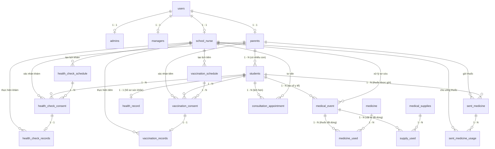

# 🗄️ Tài Liệu Thiết Kế Cơ Sở Dữ Liệu (Database Schema & Dictionary)

Tài liệu này mô tả chi tiết lược đồ cơ sở dữ liệu (`db_medical`), cấu trúc tất cả các bảng (tables), kiểu dữ liệu, ràng buộc khóa chính/khóa ngoại, và biểu đồ quan hệ thực thể (ERD). Mọi AI Agent và lập trình viên khi viết mã truy vấn (SQL / JPQL / HQL) hoặc thiết kế Entity/DTO đều phải đối chiếu với tài liệu này.

---

## 1. Biểu Đồ Quan Hệ Thực Thể (Entity Relationship Diagram - ERD)

---

## 2. Danh Mục Các Bảng Dữ Liệu (Data Dictionary)

### 2.1. Nhóm Bảng Người Dùng & Phân Quyền (User & Authentication)

#### Bảng `users`
Bảng lưu trữ thông tin đăng nhập và định danh tài khoản cốt lõi trong hệ thống.
| Tên cột | Kiểu dữ liệu | Ràng buộc | Mô tả |
| :--- | :--- | :--- | :--- |
| `user_id` | `BIGINT` | `PK`, `AUTO_INCREMENT` | Mã định danh người dùng duy nhất |
| `username` | `VARCHAR(255)` | `NOT NULL`, `UNIQUE` | Tên đăng nhập hệ thống |
| `email` | `VARCHAR(255)` | `UNIQUE`, `NULLABLE` | Email nhận mã OTP và thông báo |
| `password` | `VARCHAR(255)` | `NOT NULL` | Mật khẩu băm (BCrypt hash) |
| `role` | `VARCHAR(50)` | `NOT NULL` | Enum: `ADMIN`, `MANAGER`, `NURSE`, `PARENT` |
| `isDeleted` | `TINYINT` | `DEFAULT 0` | Cờ xóa mềm (0: Hoạt động, 1: Đã xóa) |
| `creation_date` | `DATE` | `DEFAULT CURRENT_DATE` | Ngày khởi tạo tài khoản |

#### Bảng `admins`
Lưu trữ thông tin bổ trợ của Quản trị viên (Quan hệ 1-1 với `users`).
| Tên cột | Kiểu dữ liệu | Ràng buộc | Mô tả |
| :--- | :--- | :--- | :--- |
| `admin_id` | `BIGINT` | `PK`, `AUTO_INCREMENT` | Khóa chính |
| `user_id` | `BIGINT` | `FK -> users(user_id)`, `UNIQUE` | Khóa ngoại trỏ đến tài khoản user |
| `fullname` | `VARCHAR(255)` | `NULLABLE` | Họ và tên quản trị viên |

#### Bảng `managers`
Lưu trữ thông tin cán bộ Quản lý / Ban Giám hiệu (Quan hệ 1-1 với `users`).
| Tên cột | Kiểu dữ liệu | Ràng buộc | Mô tả |
| :--- | :--- | :--- | :--- |
| `manager_id` | `BIGINT` | `PK`, `AUTO_INCREMENT` | Khóa chính |
| `user_id` | `BIGINT` | `FK -> users(user_id)`, `UNIQUE` | Khóa ngoại trỏ đến tài khoản user |
| `fullname` | `VARCHAR(255)` | `NULLABLE` | Họ và tên cán bộ quản lý |

#### Bảng `school_nurse`
Lưu trữ thông tin Y tá / Cán bộ y tế học đường (Quan hệ 1-1 với `users`).
| Tên cột | Kiểu dữ liệu | Ràng buộc | Mô tả |
| :--- | :--- | :--- | :--- |
| `school_nurse_id` | `BIGINT` | `PK`, `AUTO_INCREMENT` | Khóa chính |
| `user_id` | `BIGINT` | `FK -> users(user_id)`, `UNIQUE` | Khóa ngoại trỏ đến tài khoản user |
| `fullname` | `VARCHAR(50)` | `NULLABLE` | Họ và tên nhân viên y tế |
| `phone_number` | `VARCHAR(11)` | `NULLABLE` | Số điện thoại liên hệ |
| `address` | `TEXT` | `NULLABLE` | Địa chỉ cư trú |

#### Bảng `parents`
Lưu trữ hồ sơ Phụ huynh học sinh (Quan hệ 1-1 với `users`).
| Tên cột | Kiểu dữ liệu | Ràng buộc | Mô tả |
| :--- | :--- | :--- | :--- |
| `parent_id` | `BIGINT` | `PK`, `AUTO_INCREMENT` | Khóa chính |
| `user_id` | `BIGINT` | `FK -> users(user_id)`, `UNIQUE` | Khóa ngoại trỏ đến tài khoản user |
| `fullname` | `VARCHAR(50)` | `NULLABLE` | Họ và tên phụ huynh |
| `phone_number` | `VARCHAR(11)` | `NULLABLE` | Số điện thoại phụ huynh |
| `address` | `TEXT` | `NULLABLE` | Địa chỉ gia đình |

---

### 2.2. Nhóm Bảng Học Sinh & Hồ Sơ Sức Khỏe (Student & Health Record)

#### Bảng `students`
Lưu trữ hồ sơ thông tin học sinh trong trường.
| Tên cột | Kiểu dữ liệu | Ràng buộc | Mô tả |
| :--- | :--- | :--- | :--- |
| `student_id` | `BIGINT` | `PK`, `AUTO_INCREMENT` | Khóa chính học sinh |
| `parent_id` | `BIGINT` | `FK -> parents(parent_id)`, `NOT NULL` | Khóa ngoại phụ huynh đại diện |
| `fullname` | `VARCHAR(50)` | `NOT NULL` | Họ và tên học sinh |
| `gender` | `VARCHAR(20)` | `NOT NULL` | Enum: `MALE`, `FEMALE`, `OTHER` |
| `birth_date` | `DATE` | `NOT NULL` | Ngày sinh học sinh |
| `address` | `TEXT` | `NOT NULL` | Địa chỉ thường trú |
| `class_name` | `VARCHAR(10)` | `NOT NULL` | Tên lớp (ví dụ: `10A1`, `11B2`) |
| `createAt` | `DATE` | `DEFAULT CURRENT_DATE` | Ngày tạo bản ghi |

#### Bảng `health_record`
Hồ sơ sức khỏe tổng quát ban đầu của học sinh (Quan hệ 1-1 với `students`).
| Tên cột | Kiểu dữ liệu | Ràng buộc | Mô tả |
| :--- | :--- | :--- | :--- |
| `health_record_id` | `BIGINT` | `PK`, `AUTO_INCREMENT` | Khóa chính |
| `student_id` | `BIGINT` | `FK -> students(student_id)`, `UNIQUE` | Khóa ngoại học sinh |
| `parent_id` | `BIGINT` | `FK -> parents(parent_id)` | Khóa ngoại phụ huynh khai báo |
| `allergies` | `VARCHAR(255)` | `NOT NULL` | Tiền sử dị ứng (thuốc, phấn hoa, hải sản,...) |
| `chronic_disease` | `VARCHAR(255)` | `NOT NULL` | Bệnh mãn tính (hen suyễn, tim bẩm sinh,...) |
| `treatment_history` | `TEXT` | `NOT NULL` | Lịch sử điều trị, phẫu thuật trước đây |
| `vision` | `INT` | `NOT NULL` | Thị lực cơ bản (thang điểm 1 - 10) |
| `hearing` | `VARCHAR(255)` | `NOT NULL` | Đánh giá thính lực (Bình thường / Suy giảm) |
| `vaccination` | `VARCHAR(255)` | `NOT NULL` | Lịch sử các mũi tiêm chủng cơ bản trước đó |
| `other_health_info` | `TEXT` | `NULLABLE` | Ghi chú sức khỏe bổ sung |

---

### 2.3. Nhóm Bảng Khám Sức Khỏe Định Kỳ (Health Check)

#### Bảng `Health_check_schedule`
Lịch tổ chức khám sức khỏe do Y tá lập cho các khối/lớp.
| Tên cột | Kiểu dữ liệu | Ràng buộc | Mô tả |
| :--- | :--- | :--- | :--- |
| `health_check_schedule_id`| `BIGINT` | `PK`, `AUTO_INCREMENT` | Khóa chính lịch khám |
| `school_nurse_id` | `BIGINT` | `FK -> school_nurse(school_nurse_id)` | Y tá phụ trách lập lịch |
| `className` | `INT` | `NOT NULL` | Khối lớp được khám (ví dụ: `10`, `11`, `12`) |
| `check_date` | `DATETIME` | `NOT NULL` | Thời gian tiến hành khám |
| `sent_date` | `DATE` | `NULLABLE` | Ngày gửi thông báo đến phụ huynh |
| `create_date` | `DATE` | `DEFAULT CURRENT_DATE` | Ngày tạo lịch |
| `content` | `TEXT` | `NULLABLE` | Nội dung chương trình khám |
| `notes` | `TEXT` | `NULLABLE` | Ghi chú chuẩn bị |
| `is_sent_to_parent` | `TINYINT` | `DEFAULT 0` | Trạng thái đã gửi thông báo đến phụ huynh chưa |

#### Bảng `health_check_consent`
Phiếu lấy ý kiến phụ huynh về việc khám sức khỏe cho học sinh.
| Tên cột | Kiểu dữ liệu | Ràng buộc | Mô tả |
| :--- | :--- | :--- | :--- |
| `health_check_consent_id` | `BIGINT` | `PK`, `AUTO_INCREMENT` | Khóa chính phiếu ý kiến |
| `student_id` | `BIGINT` | `FK -> students(student_id)` | Học sinh cần khám |
| `parent_id` | `BIGINT` | `FK -> parents(parent_id)` | Phụ huynh cần phản hồi |
| `health_check_schedule_id`| `BIGINT` | `FK -> Health_check_schedule` | Thuộc lịch khám nào |
| `consent_status` | `VARCHAR(20)`| `DEFAULT 'UNCONFIRMED'` | Enum: `UNCONFIRMED`, `ACCEPTED`, `DECLINED`, `OVERDUE` |
| `is_checked_health` | `TINYINT` | `DEFAULT 0` | Đã được khám thực tế chưa |

#### Bảng `Health_check_record`
Kết quả chi tiết của buổi khám sức khỏe (Quan hệ 1-1 với `health_check_consent`).
| Tên cột | Kiểu dữ liệu | Ràng buộc | Mô tả |
| :--- | :--- | :--- | :--- |
| `health_check_id` | `BIGINT` | `PK`, `AUTO_INCREMENT` | Khóa chính kết quả khám |
| `health_check_consent_id` | `BIGINT` | `FK -> health_check_consent`, `UNIQUE` | Liên kết phiếu đồng ý |
| `performed_by_nurse_id` | `BIGINT` | `FK -> school_nurse` | Y tá trực tiếp thực hiện khám |
| `vision_result` | `INT` | `NOT NULL` | Kết quả đo thị lực (1 - 10) |
| `hearing_result` | `VARCHAR(255)`| `NOT NULL` | Kết quả đo thính lực |
| `bloodPressure` | `VARCHAR(255)`| `NULLABLE` | Chỉ số huyết áp (ví dụ: `120/80`) |
| `heartrate` | `INT` | `NOT NULL` | Nhịp tim (bpm) |
| `height` | `DOUBLE` | `NOT NULL` | Chiều cao (cm) |
| `weight` | `DOUBLE` | `NOT NULL` | Cân nặng (kg) |
| `other_result` | `VARCHAR(255)`| `NULLABLE` | Khám răng hàm mặt, da liễu,... |
| `assessment` | `VARCHAR(255)`| `NULLABLE` | Đánh giá tổng quát của y tá |
| `needs_consultation` | `TINYINT` | `DEFAULT 0` | Có cần hẹn gặp tư vấn phụ huynh không |
| `is_sent_to_parent` | `TINYINT` | `DEFAULT 0` | Đã gửi kết quả cho phụ huynh chưa |
| `is_viewed_by_parent` | `TINYINT` | `DEFAULT 0` | Phụ huynh đã xem kết quả chưa |

---

### 2.4. Nhóm Bảng Quản Lý Tiêm Chủng (Vaccination)

#### Bảng `vaccination_schedule`
Kế hoạch tổ chức tiêm chủng vaccine.
| Tên cột | Kiểu dữ liệu | Ràng buộc | Mô tả |
| :--- | :--- | :--- | :--- |
| `schedule_id` | `BIGINT` | `PK`, `AUTO_INCREMENT` | Khóa chính lịch tiêm |
| `school_nurse_id` | `BIGINT` | `FK -> school_nurse` | Y tá lập kế hoạch |
| `vaccine_type` | `VARCHAR(255)`| `NOT NULL` | Tên loại vaccine (Uốn ván, Sởi-Rubella,...) |
| `recommended_age_months` | `VARCHAR(255)`| `NULLABLE` | Độ tuổi khuyến nghị |
| `injection_date` | `DATETIME` | `NOT NULL` | Thời gian tổ chức tiêm |
| `sent_date` | `DATE` | `NULLABLE` | Ngày gửi phiếu xin ý kiến |
| `create_date` | `DATE` | `DEFAULT CURRENT_DATE` | Ngày tạo kế hoạch |
| `notes` | `TEXT` | `NULLABLE` | Ghi chú & chỉ định chống chỉ định |
| `is_sent_to_parent` | `TINYINT` | `DEFAULT 0` | Đã gửi cho phụ huynh chưa |

#### Bảng `vaccination_consent`
Phiếu xác nhận tiêm chủng từ phụ huynh.
| Tên cột | Kiểu dữ liệu | Ràng buộc | Mô tả |
| :--- | :--- | :--- | :--- |
| `vaccination_consent_id` | `BIGINT` | `PK`, `AUTO_INCREMENT` | Khóa chính phiếu tiêm |
| `student_id` | `BIGINT` | `FK -> students` | Học sinh |
| `parent_id` | `BIGINT` | `FK -> parents` | Phụ huynh phản hồi |
| `schedule_id` | `BIGINT` | `FK -> vaccination_schedule` | Thuộc lịch tiêm nào |
| `consent_status` | `VARCHAR(20)`| `DEFAULT 'UNCONFIRMED'` | Enum: `UNCONFIRMED`, `ACCEPTED`, `DECLINED`, `OVERDUE` |
| `vaccinated` | `TINYINT` | `DEFAULT 0` | Đã tiêm thực tế chưa |

#### Bảng `vaccination_record`
Kết quả sau khi tiêm chủng và theo dõi phản ứng (Quan hệ 1-1 với `vaccination_consent`).
| Tên cột | Kiểu dữ liệu | Ràng buộc | Mô tả |
| :--- | :--- | :--- | :--- |
| `vaccination_record_id` | `BIGINT` | `PK`, `AUTO_INCREMENT` | Khóa chính kết quả tiêm |
| `vaccination_consent_id` | `BIGINT` | `FK -> vaccination_consent`, `UNIQUE` | Phiếu đồng ý tiêm tương ứng |
| `performed_by_nurse_id` | `BIGINT` | `FK -> school_nurse` | Y tá thực hiện tiêm |
| `post_vaccination_condition`| `VARCHAR(255)`| `NOT NULL` | Tình trạng sau tiêm (bình thường, sốt nhẹ, dị ứng,...) |
| `notes` | `TEXT` | `NULLABLE` | Ghi chú dặn dò sau tiêm |
| `is_sent_to_parent` | `TINYINT` | `DEFAULT 0` | Đã gửi thông báo cho phụ huynh |
| `is_viewed_by_parent` | `TINYINT` | `DEFAULT 0` | Phụ huynh đã đọc thông báo |

---

### 2.5. Nhóm Bảng Sự Cố Y Tế, Thuốc & Vật Tư Tiêu Hao (Medical Events & Inventory)

#### Bảng `medical_event`
Ghi nhận tai nạn, sự cố ốm đau cấp tính xảy ra tại trường.
| Tên cột | Kiểu dữ liệu | Ràng buộc | Mô tả |
| :--- | :--- | :--- | :--- |
| `medical_event_id` | `BIGINT` | `PK`, `AUTO_INCREMENT` | Khóa chính sự kiện y tế |
| `student_id` | `BIGINT` | `FK -> students` | Học sinh gặp nạn |
| `handled_by_nurse_id` | `BIGINT` | `FK -> school_nurse` | Y tá trực tiếp xử lý sơ cứu |
| `created_by_user_id` | `BIGINT` | `FK -> users` | Người tạo bản ghi sự kiện |
| `event_time` | `TIMESTAMP` | `DEFAULT CURRENT_TIMESTAMP` | Thời điểm xảy ra sự cố |
| `location` | `VARCHAR(150)`| `NOT NULL` | Vị trí xảy ra (Sân bóng, Lớp 10A1, Căn tin,...) |
| `description` | `TEXT` | `NOT NULL` | Mô tả chi tiết triệu chứng / tai nạn |
| `initial_treatment` | `TEXT` | `NULLABLE` | Biện pháp sơ cứu ban đầu |
| `final_treatment` | `TEXT` | `NULLABLE` | Hướng xử lý tiếp theo (về lớp, về nhà, nhập viện) |
| `notes` | `TEXT` | `NULLABLE` | Ghi chú thêm |

#### Bảng `medicine`
Kho dược phẩm / tủ thuốc y tế nhà trường.
| Tên cột | Kiểu dữ liệu | Ràng buộc | Mô tả |
| :--- | :--- | :--- | :--- |
| `medicine_id` | `BIGINT` | `PK`, `AUTO_INCREMENT` | Khóa chính thuốc |
| `name` | `VARCHAR(100)`| `NOT NULL` | Tên thuốc (Paracetamol, Berberin, Oresol,...) |
| `unit` | `VARCHAR(10)` | `NOT NULL` | Đơn vị tính (viên, gói, chai, vỉ) |
| `quantity_in_stock` | `INT` | `NOT NULL` | Số lượng tồn kho hiện tại |
| `entry_date` | `DATE` | `DEFAULT CURRENT_DATE` | Ngày nhập kho |
| `expiry_date` | `DATE` | `NOT NULL` | Hạn sử dụng |

#### Bảng `medicine_used`
Ghi nhận số lượng thuốc đã dùng cho từng sự kiện cấp cứu (Bảng trung gian N-N giữa `medical_event` và `medicine`).
| Tên cột | Kiểu dữ liệu | Ràng buộc | Mô tả |
| :--- | :--- | :--- | :--- |
| `medicine_used_id` | `BIGINT` | `PK`, `AUTO_INCREMENT` | Khóa chính |
| `medicine_id` | `BIGINT` | `FK -> medicine` | Thuốc đã dùng |
| `medical_event_id` | `BIGINT` | `FK -> medical_event` | Cho sự kiện nào |
| `quantity` | `INT` | `NOT NULL` | Số lượng thuốc đã dùng |
| `notes` | `TEXT` | `NULLABLE` | Hướng dẫn liều dùng cụ thể |

#### Bảng `medical_supplies`
Kho vật tư y tế (bông gòn, băng gạc, cồn đỏ, nẹp cố định, nước muối sinh lý,...).
| Tên cột | Kiểu dữ liệu | Ràng buộc | Mô tả |
| :--- | :--- | :--- | :--- |
| `supply_id` | `BIGINT` | `PK`, `AUTO_INCREMENT` | Khóa chính vật tư |
| `name` | `VARCHAR(100)`| `NOT NULL` | Tên vật tư |
| `unit` | `VARCHAR(10)` | `NOT NULL` | Đơn vị (cuộn, chai, cái, miếng) |
| `quantity_in_stock` | `INT` | `NOT NULL` | Số lượng còn lại trong kho |
| `entry_date` | `DATE` | `DEFAULT CURRENT_DATE` | Ngày nhập kho |
| `expiry_date` | `DATE` | `NOT NULL` | Hạn sử dụng |

#### Bảng `supply_used`
Ghi nhận số lượng vật tư y tế đã sử dụng cho sự kiện cấp cứu (Bảng trung gian N-N giữa `medical_event` và `medical_supplies`).
| Tên cột | Kiểu dữ liệu | Ràng buộc | Mô tả |
| :--- | :--- | :--- | :--- |
| `supply_used_id` | `BIGINT` | `PK`, `AUTO_INCREMENT` | Khóa chính |
| `supply_id` | `BIGINT` | `FK -> medical_supplies` | Vật tư đã dùng |
| `medical_event_id` | `BIGINT` | `FK -> medical_event` | Cho sự kiện nào |
| `quantity` | `INT` | `NOT NULL` | Số lượng đã sử dụng |
| `notes` | `TEXT` | `NULLABLE` | Ghi chú sử dụng |

---

### 2.6. Nhóm Bảng Thuốc Phụ Huynh Gửi (Parent-Sent Medicine)

#### Bảng `sent_medicine`
Đơn thuốc do phụ huynh gửi cho con em uống tại trường.
| Tên cột | Kiểu dữ liệu | Ràng buộc | Mô tả |
| :--- | :--- | :--- | :--- |
| `sent_medicine_id` | `BIGINT` | `PK`, `AUTO_INCREMENT` | Khóa chính đơn gửi thuốc |
| `student_id` | `BIGINT` | `FK -> students` | Học sinh cần uống |
| `parent_id` | `BIGINT` | `FK -> parents` | Phụ huynh gửi |
| `medicine_list` | `VARCHAR(255)`| `NOT NULL` | Danh mục thuốc (tên các loại thuốc gửi) |
| `usage_instructions`| `TEXT` | `NOT NULL` | Hướng dẫn liều lượng và thời điểm uống |
| `sent_date` | `DATE` | `DEFAULT CURRENT_DATE` | Ngày gửi thuốc |

#### Bảng `sent_medicine_usage`
Nhật ký thực tế nhân viên y tế đã cho học sinh uống thuốc theo đơn phụ huynh gửi.
| Tên cột | Kiểu dữ liệu | Ràng buộc | Mô tả |
| :--- | :--- | :--- | :--- |
| `usage_id` | `BIGINT` | `PK`, `AUTO_INCREMENT` | Khóa chính nhật ký uống thuốc |
| `sent_medicine_id` | `BIGINT` | `FK -> sent_medicine` | Thuộc đơn gửi thuốc nào |
| `used_by_nurses` | `BIGINT` | `FK -> school_nurse` | Y tá trực tiếp cho uống |
| `usage_time` | `DATE` | `DEFAULT CURRENT_DATE` | Ngày/thời gian thực hiện |
| `medicine_name` | `VARCHAR(255)`| `NOT NULL` | Tên thuốc đã cho uống |
| `dosage` | `VARCHAR(255)`| `NOT NULL` | Liều lượng đã uống (ví dụ: 1 viên sau ăn trưa) |
| `notes` | `TEXT` | `NULLABLE` | Ghi chú phản ứng của học sinh |

---

### 2.7. Nhóm Bảng Lịch Hẹn Tư Vấn (Consultation Appointment)

#### Bảng `consultation_appointment`
Lịch hẹn tư vấn y tế giữa Phụ huynh và Nhân viên y tế.
| Tên cột | Kiểu dữ liệu | Ràng buộc | Mô tả |
| :--- | :--- | :--- | :--- |
| `consultation_appointment_id`| `BIGINT` | `PK`, `AUTO_INCREMENT` | Khóa chính lịch hẹn |
| `student_id` | `BIGINT` | `FK -> students` | Học sinh cần tư vấn |
| `school_nurse_id` | `BIGINT` | `FK -> school_nurse` | Y tá phụ trách buổi tư vấn |
| `scheduled_time` | `DATETIME` | `NOT NULL` | Thời gian hẹn gặp |
| `createdAt` | `DATETIME` | `DEFAULT CURRENT_TIMESTAMP` | Thời điểm tạo lịch hẹn |
| `sent_date` | `DATE` | `NULLABLE` | Ngày gửi thông báo xác nhận |
| `status` | `VARCHAR(20)`| `DEFAULT 'UNCONFIRMED'` | Enum: `UNCONFIRMED`, `ACCEPTED`, `DECLINED`, `OVERDUE` |
| `content` | `TEXT` | `NULLABLE` | Nội dung cần trao đổi tư vấn |
| `is_sent_to_parent` | `TINYINT` | `DEFAULT 0` | Đã gửi cho phụ huynh |
| `is_viewed_by_parent`| `TINYINT` | `DEFAULT 0` | Phụ huynh đã xem |

---

## 3. Các Enums Chuẩn Trong Hệ Thống (Standard Enums)

1. **`Role`** (`com.medical.schoolMedical.enums.Role`):
   - `ADMIN`: Quản trị viên
   - `MANAGER`: Ban giám hiệu / Quản lý
   - `NURSE`: Y tá học đường
   - `PARENT`: Phụ huynh học sinh
2. **`Gender`** (`com.medical.schoolMedical.enums.Gender`):
   - `MALE`: Nam
   - `FEMALE`: Nữ
   - `OTHER`: Khác
3. **`ConsentStatus`** (`com.medical.schoolMedical.enums.ConsentStatus`):
   - `UNCONFIRMED`: Chưa xác nhận (đang chờ phụ huynh phản hồi)
   - `ACCEPTED`: Đồng ý
   - `DECLINED`: Từ chối
   - `OVERDUE`: Hết hạn phản hồi
