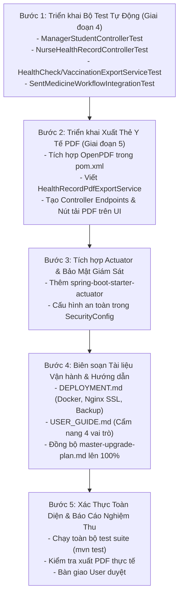

# 📋 Kế Hoạch Chi Tiết: Hoàn Thiện Giai Đoạn 4 & Giai Đoạn 5 Còn Dang Dở

- **Mã kế hoạch:** `PLAN-10`
- **Mục tiêu:** Đưa toàn bộ dự án **School Medical Management System** về trạng thái hoàn thiện 100% (Production-Ready) bằng cách nâng cấp hệ thống kiểm thử tự động (Giai đoạn 4) và hoàn thiện các tính năng nâng cao, hạ tầng giám sát, tài liệu bàn giao (Giai đoạn 5).
- **Trạng thái:** 📝 Đang chờ người dùng (User) xem xét và phê duyệt.

---

## 🎯 1. Phân Tích Hiện Trạng (Current Status Analysis)

### 📊 Giai Đoạn 4 (Hệ thống Kiểm thử Tự động - Hiện đạt ~65%)
- **Đã có:** 110 automated tests (100% PASS) bao phủ hầu hết các Service nghiệp vụ (`UserServiceTest`, `OtpServiceTest`, `HealthCheckConsentServiceTest`, `MedicalEventServiceTest`, `StudentServiceTest`, `MedicineServiceTest`, `SentMedicineServiceTest`, `VaccinationConsentServiceTest`, `StatisticsServiceTest`, `CustomUserDetailsServiceTest`, `NotificationServiceTest`) và lớp tiện ích (`ValidationUtilTest`).
- **Khoảng trống cần bù đắp:**
  1. Chưa có test cho tầng Controller trọng yếu: `ManagerStudentController` (vừa bổ sung logic thêm/sửa/xóa học sinh và validate SĐT/họ tên), `NurseHealthRecordController`, `HealthRecordController`.
  2. Chưa có test cho 2 dịch vụ xuất Excel mới tạo: `HealthCheckExportService` và `VaccinationExportService`.
  3. Chưa có test tích hợp luồng nghiệp vụ liên module (E2E Integration Test): Phụ huynh gửi đơn thuốc $\rightarrow$ Y tá tiếp nhận $\rightarrow$ Y tá ghi nhận lịch sử cho uống thuốc $\rightarrow$ Kiểm tra trạng thái và lịch sử.

### 📊 Giai Đoạn 5 (Nâng Cấp Tính Năng & Sẵn Sàng Vận Hành - Hiện đạt ~80%)
- **Đã hoàn thành cốt lõi:**
  1. Xuất báo cáo Excel (`.xlsx`) cho Khám sức khỏe & Tiêm chủng (Apache POI).
  2. Trung tâm thông báo In-App Notification (chuông thông báo, badge đếm, animation nhịp tim, dropdown xem nhanh).
  3. Docker hóa đa tầng (`Dockerfile` non-root user `spring:spring`) & `docker-compose.yml` (Spring Boot + MySQL 8.0).
  4. CI/CD GitHub Actions (`.github/workflows/ci.yml`).
- **Hạng mục còn dang dở cần hoàn thiện:**
  1. **Xuất Thẻ Y Tế Điện Tử ra file PDF (PDF Export Service):** Hiện tại phụ huynh chỉ có thể in ấn qua trình duyệt (`@media print`). Cần dịch vụ xuất file `.pdf` chính thức chuẩn mẫu trường học để tải về lưu trữ hoặc in ấn ngoại tuyến.
  2. **Spring Boot Actuator & Giám sát vận hành (Health & Metrics):** Tích hợp và cấu hình bảo mật endpoint `/actuator/health` và `/actuator/info` phục vụ Docker healthcheck probe và giám sát hệ thống.
  3. **Tài liệu Bàn giao & Vận hành (Production Deliverables):** Biên soạn `DEPLOYMENT.md` (hướng dẫn triển khai Production) và `USER_GUIDE.md` (cẩm nang hướng dẫn sử dụng chi tiết cho 4 vai trò).

---

## 🏗️ 2. Chi Tiết Các Hạng Mục Triển Khai

### 🧪 PHẦN I: HOÀN THIỆN GIAI ĐOẠN 4 (AUTOMATED TESTING)

#### Hạng mục 4.3: Kiểm thử Tầng Controller (WebMvcTest & Security Mocks)
1. **`ManagerStudentControllerTest`:**
   - `testGetAllStudents_Success()`: Kiểm tra lấy danh sách học sinh, phân trang, lọc theo lớp/tên, nạp đúng model attributes.
   - `testShowAddForm_Success()`: Kiểm tra mở form thêm học sinh với đối tượng `StudentDTO` rỗng.
   - `testCreateStudent_Success()`: POST form với họ tên hợp lệ tiếng Việt, số điện thoại chuẩn 10 số di động $\rightarrow$ Chuyển hướng `302`, flash attribute `successMessage`.
   - `testCreateStudent_ValidationError_InvalidPhone()`: POST form với SĐT sai định dạng ("12345") $\rightarrow$ Giữ nguyên form, hiển thị `BindingResult` lỗi trường `phone`.
   - `testCreateStudent_ValidationError_SpecialCharsInName()`: POST form với họ tên chứa ký tự cấm ("#Nguyễn?Văn@") $\rightarrow$ Giữ nguyên form, hiển thị lỗi trường `name`.
   - `testDeleteStudent_Success()`: POST xóa học sinh $\rightarrow$ Chuyển hướng với thông báo thành công.
   - `testDeleteStudent_DataIntegrityViolation()`: Xóa học sinh đang có dữ liệu y tế ràng buộc $\rightarrow$ Bắt ngoại lệ và hiển thị thông báo lỗi thân thiện thay vì crash 500.

2. **`NurseHealthRecordControllerTest` & `HealthRecordControllerTest`:**
   - Kiểm tra phân quyền truy cập: Nurse xem được toàn trường, Parent chỉ xem được con của mình.
   - Kiểm tra lọc danh sách hồ sơ sức khỏe theo lớp và tìm kiếm theo họ tên học sinh.
   - Kiểm tra xem chi tiết hồ sơ sức khỏe (`health_record_view`).

#### Hạng mục 4.4: Kiểm thử Dịch Vụ Xuất Excel (Export Services Tests)
1. **`HealthCheckExportServiceTest`:**
   - Mock dữ liệu lịch khám và kết quả khám sức khỏe của học sinh.
   - Gọi `exportHealthCheckScheduleToExcel(scheduleId)`.
   - Kiểm tra: `byte[]` trả về không rỗng, mở lại bằng Apache POI `XSSFWorkbook` kiểm tra tên sheet (`KetQuaKham`), số lượng dòng tiêu đề, số lượng dòng học sinh và định dạng dữ liệu (chiều cao, cân nặng, thị lực).
2. **`VaccinationExportServiceTest`:**
   - Mock dữ liệu tiêm chủng.
   - Kiểm tra `exportVaccinationScheduleToExcel(scheduleId)` tạo đúng workbook, sheet `SoTiemChung`, đầy đủ thông tin vắc-xin và phản ứng sau tiêm.

#### Hạng mục 4.5: Kiểm thử Tích Hợp Luồng Nghiệp Vụ Liên Module (E2E Integration Test)
1. **`SentMedicineWorkflowIntegrationTest`:**
   - Giả lập luồng Phụ huynh tạo đơn gửi thuốc (`SentMedicine`).
   - Y tá nhận đơn thuốc ở trạng thái `PENDING`.
   - Y tá thực hiện cho học sinh uống thuốc và ghi nhận nhật ký (`SentMedicineUsage`).
   - Xác minh trạng thái đơn thuốc chuyển sang `COMPLETED`, tồn kho thuốc được ghi nhận chính xác và lịch sử sử dụng được lưu đầy đủ.

---

### 🚀 PHẦN II: HOÀN THIỆN GIAI ĐOẠN 5 (ENHANCEMENTS & PRODUCTION READINESS)

#### Hạng mục 5.1b: Dịch Vụ Xuất Thẻ Y Tế Điện Tử Ra File PDF (PDF Export)
- **Thư viện đề xuất:** `com.github.librepdf:openpdf:2.0.3` (Mã nguồn mở chuẩn LGPL/MPL, tương thích hoàn toàn Java 21, hỗ trợ Unicode tiếng Việt qua phông chữ TTF).
- **Thiết kế dịch vụ `HealthRecordPdfExportService`:**
  - Tiêu đề văn bản chuẩn:
    ```text
    SỞ GIÁO DỤC VÀ ĐÀO TẠO
    TRƯỜNG TIỂU HỌC & TRUNG HỌC CƠ SỞ
    --- *** ---
    THẺ Y TẾ ĐIỆN TỬ HỌC SINH
    (School Electronic Health Card)
    ```
  - **Khối 1: Thông tin học sinh:** Mã định danh, Họ và tên, Giới tính, Ngày sinh, Lớp học, Họ tên phụ huynh, Số điện thoại liên hệ khẩn cấp.
  - **Khối 2: Tiền sử y tế & Dị ứng:** Bệnh mãn tính, Dị ứng thuốc/thức ăn, Nhóm máu, Lưu ý đặc biệt cho y tế học đường.
  - **Khối 3: Kết quả khám sức khỏe gần nhất:** Ngày khám, Chiều cao (cm), Cân nặng (kg), Chỉ số khối cơ thể (BMI) & Đánh giá thể trạng, Thị lực mắt trái/phải, Khám lâm sàng tai-mũi-họng, răng-hàm-mặt.
  - **Khối 4: Xác nhận & Chữ ký:** Vùng chữ ký của Nhân viên y tế phụ trách và Chữ ký xác nhận của Phụ huynh học sinh.
- **Tích hợp Endpoint & Giao diện:**
  - `GET /parent/health-record/export-pdf/{id}` (Phụ huynh tải thẻ y tế của con).
  - `GET /nurse/health-records/export-pdf/{id}` (Y tá tải thẻ y tế học sinh).
  - Bổ sung nút **"📥 Tải Thẻ Y Tế (PDF)"** trực tiếp trên trang xem hồ sơ sức khỏe (`health_record_view.html` của cả Nurse và Parent).

#### Hạng mục 5.4: Spring Boot Actuator & Cấu Hình Giám Sát Production
- Thêm dependency `spring-boot-starter-actuator` vào `pom.xml`.
- Cấu hình an toàn trong `application.properties`:
  ```properties
  management.endpoints.web.exposure.include=health,info,metrics
  management.endpoint.health.show-details=when-authorized
  management.endpoint.health.roles=ADMIN
  ```
- Cấu hình trong `SecurityConfig.java`:
  - Cho phép truy cập công khai endpoint `/actuator/health` (phục vụ healthcheck probe của Docker/Kubernetes).
  - Giới hạn các endpoint chi tiết khác (`/actuator/**`) chỉ cho vai trò `ADMIN`.

#### Hạng mục 5.5: Bộ Tài Liệu Bàn Giao & Vận Hành (Production Deliverables)
1. **`docs/DEPLOYMENT.md`:**
   - Hướng dẫn cấu hình môi trường Production (Java 21, Docker Engine, Docker Compose, MySQL 8).
   - Hướng dẫn khởi chạy ứng dụng tự động 1 lệnh: `docker compose up -d`.
   - Mẫu file `.env` chuẩn Production với hướng dẫn bảo mật credentials.
   - Hướng dẫn cấu hình Reverse Proxy Nginx & Chứng chỉ SSL HTTPS miễn phí (Let's Encrypt / Certbot).
   - Hướng dẫn kiểm tra trạng thái dịch vụ (Health check & Actuator).
   - Quy trình sao lưu định kỳ (Crontab backup) và khôi phục CSDL khi có sự cố.
2. **`docs/USER_GUIDE.md`:**
   - Cẩm nang hướng dẫn sử dụng trực quan, phân chia theo 4 vai trò chính:
     - 🛡️ **Quản trị viên (Admin):** Quản lý tài khoản, cấp phát quyền, theo dõi biểu đồ thống kê KPI, giám sát hệ thống.
     - 🎓 **Quản lý học sinh (Manager):** Quản lý hồ sơ học sinh, lọc lớp, thêm mới, sửa đổi thông tin và phân công lớp học.
     - 🩺 **Y tá học đường (Nurse):** Lập lịch khám/tiêm, gửi phiếu đồng ý đến phụ huynh, ghi nhận kết quả khám, xuất báo cáo Excel & PDF, quản lý kho thuốc & vật tư y tế, cho học sinh uống thuốc theo đơn phụ huynh gửi.
     - 👨‍👩‍👧 **Phụ huynh (Parent):** Xem thẻ y tế điện tử, gửi thuốc kèm hướng dẫn uống thuốc, xác nhận/từ chối phiếu khám & tiêm chủng, nhận thông báo thời gian thực.
3. **Cập nhật Roadmap Tổng thể:**
   - Cập nhật [master-upgrade-plan.md](file:///d:/Old_Project/School_Medical_Management_System/School-Medical-Management-System/docs/plans/master-upgrade-plan.md) và [05-enhancements-and-launch.md](file:///d:/Old_Project/School_Medical_Management_System/School-Medical-Management-System/docs/plans/05-enhancements-and-launch.md) đánh dấu hoàn thành 100% tất cả 5 giai đoạn.

---

## 🗓️ 3. Lộ Trình Thực Hiện Từng Bước (Implementation Steps)



---

## 🔍 4. Kế Hoạch Kiểm Chứng & Nghiệm Thu (Verification Plan)

### Kiểm thử Tự Động (Automated Verification)
- Chạy lệnh:
  ```powershell
  .\mvnw.cmd clean test
  ```
- **Tiêu chí thành công:**
  - Toàn bộ các test cases (dự kiến ~125-130 tests) chạy thành công 100% (`BUILD SUCCESS`, 0 Failures, 0 Errors).
  - Báo cáo JaCoCo coverage tăng vượt bậc cho tầng Controller và Export services.

### Kiểm thử Thực Tế (Manual Verification)
1. **Kiểm tra xuất PDF Thẻ Y Tế:**
   - Đăng nhập tài khoản Phụ huynh (`0912345671` / `123456`) $\rightarrow$ Hồ sơ sức khỏe $\rightarrow$ Xem chi tiết $\rightarrow$ Bấm nút "Tải Thẻ Y Tế (PDF)".
   - Mở file PDF tải về: Kiểm tra định dạng A4, logo, font tiếng Việt hiển thị sắc nét không lỗi dấu, thông tin học sinh và bảng khám đầy đủ.
   - Đăng nhập tài khoản Y tá (`0977112234` / `123456`) $\rightarrow$ Hồ sơ sức khỏe $\rightarrow$ Xem chi tiết $\rightarrow$ Tải file PDF tương tự.
2. **Kiểm tra Actuator Endpoint:**
   - Truy cập `http://localhost:8080/yte/actuator/health` $\rightarrow$ Trả về `{"status":"UP"}`.
   - Thử truy cập `/actuator/metrics` bằng tài khoản không phải Admin $\rightarrow$ Bị chặn 403 Forbidden.
