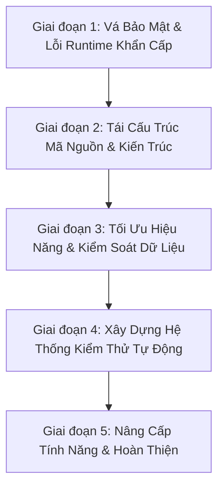

# 📋 Kế Hoạch Nâng Cấp Toàn Diện Dự Án (Master Upgrade Plan)

Tài liệu này là **kế hoạch tổng thể (Master Plan)** tổng hợp toàn bộ các vấn đề kỹ thuật, lỗi tiềm ẩn, lỗ hổng bảo mật và các hạng mục cần tái cấu trúc (refactoring) của dự án **School Medical Management System**.

Từ kế hoạch tổng thể này, khi bắt đầu thực hiện từng giai đoạn, chúng ta sẽ trích xuất thành các file kế hoạch chi tiết độc lập trong thư mục `docs/plans/` (ví dụ: `01-critical-security-and-bugs.md`, `02-architecture-refactoring.md`,...).

---

## 🎯 Mục Tiêu Tổng Thể (Objectives)

1. **Bảo mật tuyệt đối (Security-First):** Loại bỏ 100% các lỗ hổng chiếm quyền tài khoản (Account Takeover), IDOR, lộ thông tin nhạy cảm và kích hoạt lại cơ chế phòng chống CSRF.
2. **Loại bỏ lỗi tiềm ẩn (Bug-Free Runtime):** Sửa dứt điểm các lỗi runtime Hibernate (`MultipleBagFetchException`), race condition OTP và lỗi đệ quy `@Data`.
3. **Kiến trúc chuẩn mực (Clean Architecture):** Tái tổ chức package, khử phụ thuộc vòng (`@Lazy`), sửa lỗi chính tả, dọn dẹp code thừa.
4. **Hiệu năng & Khả năng mở rộng (Performance & Scalability):** Tối ưu hóa batch insert khi gửi lịch khám cho hàng trăm học sinh, hỗ trợ lọc thống kê linh hoạt theo năm.
5. **Chất lượng được chứng thực (Test Coverage):** Xây dựng bộ kiểm thử tự động (Unit & Integration Tests) bảo vệ toàn bộ nghiệp vụ quan trọng.

---

## 🗺️ Lộ Trình Triển Khai 5 Giai Đoạn (Phased Roadmap)

---

## 📌 CHI TIẾT CÁC HẠNG MỤC CẦN SỬA THEO GIAI ĐOẠN

### 🔴 Giai Đoạn 1: Vá Các Lỗ Hổng Bảo Mật & Lỗi Runtime Nghiêm Trọng
> *Mục tiêu: Đưa ứng dụng về trạng thái an toàn, không thể bị hack tài khoản và không bị crash khi người dùng sử dụng.*

- [ ] **1.1. Vá lỗ hổng Chiếm quyền tài khoản (Account Takeover / Broken Authentication):**
  - **Hiện trạng:** `PasswordController` cho phép bất kỳ ai gọi `POST /reset-password?userID={id}` để đổi mật khẩu mà không cần token xác thực OTP hay session.
  - **Giải pháp:** Tạo bảng hoặc cơ chế lưu trữ `PasswordResetToken` (token ngẫu nhiên UUID mã hóa, có thời hạn 5-10 phút). Khi xác thực OTP thành công, trả về Token này. Endpoint `/reset-password` bắt buộc phải kèm theo Token hợp lệ mới được đổi mật khẩu.
- [ ] **1.2. Bảo vệ thông tin đăng nhập nhạy cảm (Hardcoded Credentials):**
  - **Hiện trạng:** [application.properties](file:///d:/Old_Project/School_Medical_Management_System/School-Medical-Management-System/src/main/resources/application.properties) lưu trực tiếp App Password Gmail và mật khẩu CSDL.
  - **Giải pháp:** Chuyển sang sử dụng biến môi trường: `${SPRING_MAIL_USERNAME}`, `${SPRING_MAIL_PASSWORD}`, `${SPRING_DATASOURCE_PASSWORD}` kèm fallback an toàn.
- [ ] **1.3. Kích hoạt lại CSRF Protection & Chuẩn hóa HTTP Methods:**
  - **Hiện trạng:** `csrf().disable()` bị tắt trong [SecurityConfig.java](file:///d:/Old_Project/School_Medical_Management_System/School-Medical-Management-System/src/main/java/com/medical/schoolMedical/security/SecurityConfig.java). Đồng thời các hành động xóa dữ liệu đang dùng HTTP `GET` (`/parent/health-record/delete/{id}`, `/admin/delete-user/{id}`).
  - **Giải pháp:** Bật lại CSRF Protection cho các Form Thymeleaf. Chuyển toàn bộ các endpoint xóa sang `@PostMapping` hoặc `@DeleteMapping`.
- [ ] **1.4. Vá lỗ hổng phân quyền cấp đối tượng (IDOR / Broken Object-Level Authorization):**
  - **Hiện trạng:** Phụ huynh có thể xóa hồ sơ sức khỏe của học sinh khác ([HealthRecordController.java:110](file:///d:/Old_Project/School_Medical_Management_System/School-Medical-Management-System/src/main/java/com/medical/schoolMedical/controller/user/HealthRecordController.java#L110)), hoặc gửi thuốc cho học sinh bất kỳ không phải con mình ([SentMedicineController.java:74](file:///d:/Old_Project/School_Medical_Management_System/School-Medical-Management-System/src/main/java/com/medical/schoolMedical/controller/parent/SentMedicineController.java#L74)).
  - **Giải pháp:** Bổ sung kiểm tra quyền sở hữu: Kiểm tra `student.getParent().getId() == currentParent.getId()` trước khi thực hiện bất kỳ thao tác lưu/xóa nào.
- [ ] **1.5. Nâng cấp cơ chế OTP trong `OtpService`:**
  - **Hiện trạng:** Dùng `java.util.Random` (dễ đoán số), OTP chỉ 4 số, không bị hủy sau khi dùng, race condition khi người dùng gửi lại OTP.
  - **Giải pháp:** Dùng `java.security.SecureRandom`, nâng độ dài OTP lên 6 chữ số, hủy ngay OTP khi xác thực thành công, hủy lịch trình cũ khi sinh OTP mới.
- [ ] **1.6. Sửa lỗi `MultipleBagFetchException` trong Hibernate:**
  - **Hiện trạng:** [MedicalEventRepository.java:15-19](file:///d:/Old_Project/School_Medical_Management_System/School-Medical-Management-System/src/main/java/com/medical/schoolMedical/repositories/MedicalEventRepository.java#L15-L19) `JOIN FETCH` đồng thời 2 `List` (`medicineUsed` và `supplyUsed`) gây lỗi runtime khi gọi hàm `findByIdWithDetails`.
  - **Giải pháp:** Đổi kiểu dữ liệu của collection sang `Set` hoặc chia thành 2 truy vấn riêng biệt/dùng `@BatchSize`.

---

### 🟡 Giai Đoạn 2: Tái Cấu Trúc Mã Nguồn & Kiến Trúc (Architecture & Cleanup)
> *Mục tiêu: Đưa mã nguồn về đúng chuẩn thiết kế phần mềm, dễ đọc, dễ bảo trì, sạch sẽ.*

- [ ] **2.1. Phân bổ lại Package Controller:**
  - **Hiện trạng:** Các Controller của Y tá (`NurseHealthRecordController`, `MedicineController`, `MedicalSupplyController`, `MedicalEventController`) và Phụ huynh (`HealthRecordController`) đang nằm lẫn trong package `controller/user`.
  - **Giải pháp:** Di chuyển các controller của y tá về `com.medical.schoolMedical.controller.schoolNurse` và của phụ huynh về `com.medical.schoolMedical.controller.parent`.
- [ ] **2.2. Sửa lỗi chính tả (Typo) Repository:**
  - **Hiện trạng:** File và interface [ParentRepositoty.java](file:///d:/Old_Project/School_Medical_Management_System/School-Medical-Management-System/src/main/java/com/medical/schoolMedical/repositories/ParentRepositoty.java) bị viết sai chữ `t` thành `Repositoty`.
  - **Giải pháp:** Đổi tên thành `ParentRepository.java` và refactor toàn bộ các class đang inject repository này.
- [ ] **2.3. Khử phụ thuộc vòng (Circular Dependencies):**
  - **Hiện trạng:** [HealthCheckConsentService.java](file:///d:/Old_Project/School_Medical_Management_System/School-Medical-Management-System/src/main/java/com/medical/schoolMedical/service/HealthCheckConsentService.java) dùng `@Lazy` để phụ thuộc lẫn nhau với `HealthCheckScheduleService` và `HealthCheckRecordService`.
  - **Giải pháp:** Tách tầng nghiệp vụ điều phối chung hoặc tách các method dùng chung ra service độc lập để loại bỏ `@Lazy`.
- [ ] **2.4. Dọn dẹp mã nguồn thừa (Dead Code Hygiene):**
  - Xóa file thử nghiệm [Trangchutamthoi.java](file:///d:/Old_Project/School_Medical_Management_System/School-Medical-Management-System/src/main/java/com/medical/schoolMedical/controller/admin/Trangchutamthoi.java).
  - Xóa bỏ các khối code chú thích (commented out code) không còn sử dụng.
- [ ] **2.5. Thay thế `@Data` trên JPA Entities:**
  - **Hiện trạng:** Toàn bộ Entity đều dùng `@Data` của Lombok, dễ gây đệ quy vô hạn trong `toString()` và lỗi tracking entity.
  - **Giải pháp:** Chuyển sang `@Getter`, `@Setter`, `@NoArgsConstructor`, `@AllArgsConstructor` và tự định nghĩa `equals()`/`hashCode()` dựa trên ID hoặc Business Key.
- [ ] **2.6. Chuẩn hóa mã lỗi trong `ErrorCode`:**
  - **Hiện trạng:** Mã `ERR057` và `ERR059` bị gán trùng cho nhiều lỗi khác nhau.
  - **Giải pháp:** Rà soát và cấp phát mã lỗi duy nhất cho từng trường hợp.

---

### 🟢 Giai Đoạn 3: Tối Ưu Hiệu Năng & Kiểm Soát Dữ Liệu (Performance & Validation)
> *Mục tiêu: Đảm bảo hệ thống chạy nhanh, chịu tải tốt khi thao tác dữ liệu lớn và chặn đứng dữ liệu rác từ đầu vào.*

- [ ] **3.1. Tối ưu hóa gửi lịch hàng loạt (Batch Processing):**
  - **Hiện trạng:** [HealthCheckConsentService.java:105-112](file:///d:/Old_Project/School_Medical_Management_System/School-Medical-Management-System/src/main/java/com/medical/schoolMedical/service/HealthCheckConsentService.java#L105-L112) lưu từng consent trong vòng `for`, không có `@Transactional`.
  - **Giải pháp:** Thêm `@Transactional`, thu thập toàn bộ consent vào `List` và gọi `healthCheckConsentRepository.saveAll(consents)`.
- [ ] **3.2. Linh hoạt hóa năm thống kê:**
  - **Hiện trạng:** [AdminController.java:49](file:///d:/Old_Project/School_Medical_Management_System/School-Medical-Management-System/src/main/java/com/medical/schoolMedical/controller/admin/AdminController.java#L49) đang fix cứng năm `2025`.
  - **Giải pháp:** Cho phép nhận `year` từ `@RequestParam(required = false)`, mặc định lấy `Year.now().getValue()`.
- [ ] **3.3. Chuẩn hóa Validation toàn diện:**
  - Áp dụng Bean Validation (`@NotBlank`, `@NotNull`, `@Min`, `@Max`, `@Email`, `@Size`) cho toàn bộ DTO tiếp nhận dữ liệu từ Form.
  - Sử dụng `@Valid` hoặc `@Validated` tại tất cả các phương thức Controller.

---

### 🔵 Giai Đoạn 4: Xây Dựng Hệ Thống Kiểm Thử Tự Động (Automated Testing)
> *Mục tiêu: Đạt tỷ lệ bao phủ kiểm thử (Test Coverage) > 75%, đảm bảo không bị lỗi hồi quy (Regression).*

- [ ] **4.1. Unit Tests cho Service Layer:**
  - `UserServiceTest`: Kiểm tra đăng ký, đăng nhập, mã hóa mật khẩu.
  - `OtpServiceTest`: Kiểm tra sinh mã ngẫu nhiên, xác thực đúng/sai, kiểm tra hết hạn.
  - `HealthCheckConsentServiceTest`: Kiểm tra luồng gửi phiếu đồng ý, phê duyệt và từ chối.
  - `MedicalEventServiceTest`: Kiểm tra trừ kho thuốc/vật tư khi xảy ra sự cố y tế.
- [ ] **4.2. Integration Tests cho Security & Controller:**
  - Kiểm tra phân quyền truy cập: Parent không được vào URL của Nurse/Admin, Anonymous không được vào URL riêng tư.
  - Kiểm tra endpoint Reset Password đảm bảo không bị bypass.

---

### 🟣 Giai Đoạn 5: Nâng Cấp Tính Năng & Hoàn Thiện (Enhancements & Polish)
> *Mục tiêu: Đưa dự án lên tầm hoàn chỉnh, sẵn sàng triển khai thực tế.*

- [ ] **5.1. Xuất báo cáo (Export PDF / Excel):**
  - Tích hợp Apache POI hoặc iText để xuất phiếu khám sức khỏe định kỳ và sổ theo dõi tiêm chủng ra file Excel / PDF cho phụ huynh và nhà trường.
- [ ] **5.2. Hệ thống thông báo thời gian thực (In-App Notifications):**
  - Hiển thị chuông thông báo trực tiếp trên giao diện khi phụ huynh có phiếu khám/tiêm mới cần xác nhận.
- [ ] **5.3. Docker hóa & Cấu hình CI/CD:**
  - Viết `Dockerfile` và `docker-compose.yml` (chạy đồng thời Spring Boot App và MySQL).
  - Thiết lập GitHub Actions tự động build và chạy test khi có commit mới.

---

*Tài liệu này được lưu tại `docs/plans/master-upgrade-plan.md` và sẽ là kim chỉ nam trong suốt quá trình phát triển dự án.*
