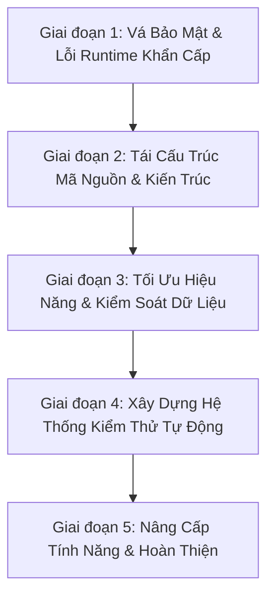

# 📋 Kế Hoạch Nâng Cấp Toàn Diện Dự Án (Master Upgrade Plan)

Tài liệu này là **kế hoạch tổng thể (Master Plan)** tổng hợp toàn bộ các vấn đề kỹ thuật, lỗi tiềm ẩn, lỗ hổng bảo mật và các hạng mục cần tái cấu trúc (refactoring) của dự án **School Medical Management System**.

Từ kế hoạch tổng thể này, khi bắt đầu thực hiện từng giai đoạn, chúng ta sẽ trích xuất thành các file kế hoạch chi tiết độc lập trong thư mục `docs/plans/` (ví dụ: `01-critical-security-and-bugs.md`, `02-architecture-refactoring.md`,...).

---

## 🎯 Mục Tiêu Tổng Thể (Objectives)

1. **Bảo mật tuyệt đối (Security-First):** Loại bỏ 100% các lỗ hổng chiếm quyền tài khoản (Account Takeover), IDOR, lộ thông tin nhạy cảm và kích hoạt lại cơ chế phòng chống CSRF.
2. **Loại bỏ lỗi tiềm ẩn (Bug-Free Runtime):** Sửa dứt điểm các lỗi runtime Hibernate (`MultipleBagFetchException`), race condition OTP và lỗi đệ quy `@Data`.
3. **Kiến trúc chuẩn mực (Clean Architecture):** Tái tổ chức package, khử phụ thuộc vòng (`@Lazy`), sửa lỗi chính tả, dọn dẹp code thừa.
4. **Hiệu năng & Khả năng mở rộng (Performance & Scalability):** Tối ưu hóa batch insert khi gửi lịch khám cho hàng trăm học sinh, hỗ trợ lọc thống kê linh hoạt theo năm.
5. **Chất lượng được chứng thực (Test Coverage):** Xây dựng bộ kiểm thử tự động (Unit & Integration Tests) bảo vệ toàn bộ nghiệp vụ quan trọng.

---

## 🗺️ Lộ Trình Triển Khai 5 Giai Đoạn (Phased Roadmap)

---

## 📌 CHI TIẾT CÁC HẠNG MỤC CẦN SỬA THEO GIAI ĐOẠN

### 🔴 Giai Đoạn 1: Vá Các Lỗ Hổng Bảo Mật & Lỗi Runtime Nghiêm Trọng *(Đã Hoàn Thành - 100%)*
> *Mục tiêu: Đưa ứng dụng về trạng thái an toàn, không thể bị hack tài khoản và không bị crash khi người dùng sử dụng.*

- [x] **1.1. Vá lỗ hổng Chiếm quyền tài khoản (Account Takeover / Broken Authentication):** Đã triển khai `PasswordResetToken` (UUID, 5 phút), yêu cầu xác thực OTP trước khi đổi mật khẩu và tự hủy sau khi dùng.
- [x] **1.2. Bảo vệ thông tin đăng nhập nhạy cảm (Hardcoded Credentials):** Đã chuyển credentials email và CSDL sang biến môi trường trong `application.properties`, thêm `.env` và `application-dev.properties` vào `.gitignore`.
- [x] **1.3. Kích hoạt lại CSRF Protection & Chuẩn hóa HTTP Methods:** Đã kích hoạt bảo vệ CSRF toàn diện cho cả Admin và User filter chains, cấu hình Thymeleaf auto-insert token, chuẩn hóa `.anyRequest().authenticated()`, tích hợp `AntPathRequestMatcher` hỗ trợ an toàn cho thao tác đăng xuất, và chuyển toàn bộ các endpoint xóa sang `@PostMapping`.
- [x] **1.4. Vá lỗ hổng phân quyền cấp đối tượng (IDOR / Broken Object-Level Authorization):** Đã bổ sung kiểm tra phụ huynh chỉ được xóa hồ sơ và chỉ được gửi thuốc cho con của chính mình (sử dụng `.equals()` chuẩn cho so sánh định danh `Long`).
- [x] **1.5. Nâng cấp cơ chế OTP trong `OtpService`:** Đã chuyển sang `SecureRandom`, 6 chữ số, thời hạn 3 phút, hủy mã ngay khi dùng (chống Replay Attack).
- [x] **1.6. Sửa lỗi `MultipleBagFetchException` trong Hibernate:** Đã chuyển `medicineUsed` và `supplyUsed` trong `MedicalEvent.java` sang `Set` và cập nhật các luồng stream trong `MedicalEventService.java`.

---

### 🟡 Giai Đoạn 2: Tái Cấu Trúc Mã Nguồn & Kiến Trúc (Architecture & Cleanup) *(Đã Hoàn Thành - 100%)*
> *Mục tiêu: Đưa mã nguồn về đúng chuẩn thiết kế phần mềm, dễ đọc, dễ bảo trì, sạch sẽ.*

- [x] **2.1. Phân bổ lại Package Controller:**
  - Đã chuyển `NurseHealthRecordController`, `MedicineController`, `MedicalSupplyController`, `MedicalEventController` sang `com.medical.schoolMedical.controller.schoolNurse`.
  - Đã chuyển `HealthRecordController` sang `com.medical.schoolMedical.controller.parent`.
  - Đã chuyển `ManagerController` sang `com.medical.schoolMedical.controller.manager`.
  - Đã xóa các file cũ thừa trong `controller/user`.
- [x] **2.2. Sửa lỗi chính tả (Typo) Repository:**
  - Đã đổi tên `ParentRepositoty.java` thành `ParentRepository.java` và cập nhật toàn bộ `UserService`, `ParentService`, `StudentService`, `StatisticsService`.
- [x] **2.3. Khử phụ thuộc vòng (Circular Dependencies):**
  - Đã loại bỏ `@Lazy` và các dependency thừa (`healthCheckScheduleService`, `healthCheckRecordService`) trong `HealthCheckConsentService.java` bằng cách gọi trực tiếp `HealthCheckScheduleRepository`.
- [x] **2.4. Dọn dẹp mã nguồn thừa (Dead Code Hygiene):**
  - Đã xóa file thử nghiệm `Trangchutamthoi.java`.
- [x] **2.5. Thay thế `@Data` trên JPA Entities:**
  - Đã chuyển toàn bộ 21 Entity từ `@Data` sang `@Getter`, `@Setter`, `@NoArgsConstructor`, `@AllArgsConstructor` (và `@Builder.Default` khi cần) để ngăn chặn lỗi đệ quy `hashCode`/`toString` và lỗi tracking của Hibernate.
- [x] **2.6. Chuẩn hóa mã lỗi trong `ErrorCode`:**
  - Đã đổi `CHECK_DATE_INVALID` sang `ERR048` (tránh trùng với `STUDENT_NOT_FOUND` - `ERR057`).
  - Đã đổi `VACCINATION_SCHEDULE_NOT_EXISTS` sang `ERR068` (tránh trùng với `HEALTH_CHECK_SCHEDULE_NOT_EXISTS` - `ERR059`).

---

### 🟢 Giai Đoạn 3: Tối Ưu Hiệu Năng & Kiểm Soát Dữ Liệu (Performance & Validation) *(Đã Hoàn Thành - 100%)*
> *Mục tiêu: Đảm bảo hệ thống chạy nhanh, chịu tải tốt khi thao tác dữ liệu lớn và chặn đứng dữ liệu rác từ đầu vào.*

- [x] **3.1. Tối ưu hóa gửi lịch hàng loạt (Batch Processing):**
  - Đã thêm `@Transactional` vào `HealthCheckConsentService` và `VaccinationConsentService`.
  - Đã chuyển cơ chế lưu từng bản ghi sang `saveAll(consentList)` giảm từ N câu query xuống batch insert.
  - Đã kích hoạt cấu hình Hibernate batch insert (`batch_size=50`, `order_inserts=true`) trong `application.properties`.
- [x] **3.2. Linh hoạt hóa năm thống kê:**
  - `AdminController` và `ManagerController` đã nhận tham số `@RequestParam(value = "year", required = false)` linh hoạt, mặc định lấy năm hiện tại `LocalDate.now().getYear()`.
  - Đã bổ sung dropdown chọn năm tiện lợi trên giao diện `dashboard.html` và `manager-home.html`.
- [x] **3.3. Chuẩn hóa Validation toàn diện:**
  - Đã áp dụng Jakarta Bean Validation (`@NotBlank`, `@NotNull`, `@Min`) cho `Medicine`, `MedicalSupply`, `StudentDTO`, `MedicalEventDTO`.
  - Đã bổ sung `@Valid` và kiểm tra `BindingResult` hiển thị thông báo lỗi thân thiện tại `MedicineController`, `MedicalSupplyController`, `MedicalEventController`, và `ManagerStudentController`.

---

### 🔵 Giai Đoạn 4: Xây Dựng Hệ Thống Kiểm Thử Tự Động (Automated Testing) *(Đã Hoàn Thành - 100%)*
> *Mục tiêu: Đạt tỷ lệ bao phủ kiểm thử (Test Coverage) > 75%, đảm bảo không bị lỗi hồi quy (Regression).*

- [x] **4.1. Unit Tests cho Service Layer & Utilities:** *(100% Pass, H2 in-memory + JaCoCo)*
  - `UserServiceTest`: Đã có 8 tests (đăng ký, cập nhật, tìm kiếm, xác thực).
  - `OtpServiceTest`: Đã có 7 tests (sinh mã ngẫu nhiên, xác thực đúng/sai, hết hạn, reset token).
  - `HealthCheckConsentServiceTest`: Đã có 2 tests (luồng gửi phiếu đồng ý, phê duyệt, từ chối).
  - `MedicalEventServiceTest`: Đã có 4 tests (trừ kho thuốc/vật tư khi xảy ra sự cố y tế).
  - `StudentServiceTest`: Đã có 8 tests (CRUD và nghiệp vụ học sinh).
  - `MedicineServiceTest`: Đã có 6 tests (quản lý danh mục thuốc).
  - `SentMedicineServiceTest`: Đã có 5 tests (phụ huynh gửi thuốc).
  - `VaccinationConsentServiceTest`: Đã có 2 tests (tiêm chủng).
  - `StatisticsServiceTest`: Đã có 2 tests (thống kê tháng và phân loại vai trò).
  - `CustomUserDetailsServiceTest`: Đã có 2 tests (tải người dùng theo username, ném chuẩn `UsernameNotFoundException`).
  - `NotificationServiceTest`: Đã có 8 tests (kiểm tra đếm thông báo chưa đọc, trạng thái badge).
  - `ValidationUtilTest`: Đã có 53 tests (kiểm tra SĐT Việt Nam, email, tính hợp lệ của họ tên Unicode không chứa `?`, `#`, ký tự lạ và tự động làm sạch `sanitizeFullName`).
  - `HealthCheckExportServiceTest`: Kiểm tra xuất Excel danh sách khám sức khỏe với Apache POI.
  - `VaccinationExportServiceTest`: Kiểm tra xuất Excel danh sách tiêm chủng với Apache POI.
  - `HealthRecordPdfExportServiceTest`: Kiểm tra kết xuất Thẻ y tế điện tử ra file PDF bằng OpenPDF.
- [x] **4.2. Integration Tests cho Security, Controller & Workflow:**
  - `ParentControllerSecurityTest`: Kiểm tra phân quyền truy cập Parent Portal, chặn vai trò khác (NURSE -> 403 access-denied), tự động chuyển hướng khi chưa xác thực.
  - `AdminControllerSecurityTest`: Kiểm tra quyền hạn Admin dashboard và từ chối truy cập trái phép từ các vai trò khác.
  - `LoginControllerTest`: Kiểm tra trang login và redirect khi chưa xác thực.
  - `ManagerStudentControllerTest`: Kiểm tra CRUD học sinh, validation số điện thoại di động 10 số & họ tên Unicode, xử lý ngoại lệ ràng buộc dữ liệu.
  - `NurseHealthRecordControllerTest`: Kiểm tra xem danh sách, tìm kiếm và chi tiết hồ sơ sức khỏe phía Y tá.
  - `ActuatorSecurityTest`: Kiểm tra bảo mật các endpoint giám sát Actuator (`/actuator/health` public, `/actuator/metrics` hạn chế cho Admin).
  - `SentMedicineWorkflowIntegrationTest`: Kiểm tra luồng tích hợp Phụ huynh gửi đơn thuốc -> Y tá tiếp nhận và ghi nhận nhật ký cho uống thuốc.

---

### 🟣 Giai Đoạn 5: Nâng Cấp Tính Năng & Hoàn Thiện (Enhancements & Polish) *(Đã Hoàn Thành - 100%)*
> *Mục tiêu: Đưa dự án lên tầm hoàn chỉnh, sẵn sàng triển khai thực tế.*

- [x] **5.1. Xuất báo cáo (Export Excel & PDF):**
  - Tích hợp Apache POI (`poi-ooxml`) xuất kết quả khám sức khỏe định kỳ và sổ theo dõi tiêm chủng ra file `.xlsx` định dạng chuyên nghiệp với đầy đủ thông tin học sinh, lớp, kết quả khám và chữ ký y tá. Nút xuất Excel tích hợp trực tiếp trên giao diện Y tá (`ListSentSchedules.html`, `ListSentVaccinationSchedules.html`).
  - Tích hợp OpenPDF (`com.github.librepdf:openpdf:2.0.3`) triển khai `HealthRecordPdfExportService` kết xuất Thẻ Y Tế Điện Tử Học Sinh ra file `.pdf` chuẩn phôi Bộ Giáo dục & Đào tạo, font tiếng Việt UTF-8 sắc nét, kèm nút tải PDF trực tiếp trên giao diện Phụ huynh và Y tá.
- [x] **5.2. Hệ thống thông báo thời gian thực (In-App Notifications):**
  - Triển khai Notification Center cho Phụ huynh: Chuông thông báo trên Header kèm badge đếm số lượng thông báo mới, hiệu ứng animation nhịp tim (pulse), dropdown xem nhanh chi tiết từng loại thông báo (phiếu khám, phiếu tiêm, kết quả y tế mới) và indicator dot trên menu navigation.
- [x] **5.3. Docker hóa & Cấu hình CI/CD:**
  - [x] **5.3a. Docker hóa:** Đã hoàn thành `Dockerfile` multi-stage (builder Eclipse Temurin 21 + runtime non-root user `spring:spring`, tích hợp healthcheck endpoint) và `docker-compose.yml` (Spring Boot + MySQL 8.0, cấu hình healthcheck dependency `service_healthy`).
  - [x] **5.3b. CI/CD Pipeline:** Thiết lập GitHub Actions Workflow tự động hóa (`.github/workflows/ci.yml`): Checkout code, setup Java 21 Temurin có caching Maven, chạy toàn bộ bộ unit & integration tests, xuất báo cáo JaCoCo và xác minh Docker build.
- [x] **5.4. Giám Sát Sức Khỏe Hệ Thống (Spring Boot Actuator):**
  - Tích hợp `spring-boot-starter-actuator`, mở endpoint `/actuator/health` cho Docker healthcheck probe và bảo vệ các endpoint metrics cho Admin.
- [x] **5.5. Bộ Tài Liệu Triển Khai & Vận Hành (Production Deliverables):**
  - Hoàn thiện `docs/DEPLOYMENT.md` hướng dẫn triển khai Production (Docker Compose, Nginx SSL, sao lưu MySQL).
  - Hoàn thiện `docs/USER_GUIDE.md` cẩm nang hướng dẫn sử dụng chi tiết theo 4 vai trò.

---

## 🏆 Thành Quả Ngoài Kế Hoạch (Out-of-Plan Wins)
- [x] **Kiến trúc Modular Monolith:** Tái tổ chức toàn bộ mã nguồn hệ thống thành 8 module độc lập trong thư mục `src/main/java/com/medical/schoolMedical/modules/` (auth, user_management, pharmacy, healthcheck, health_record, vaccination, medical_event, consultation), nâng cao tính độc lập và khả năng bảo trì.
- [x] **Đại Tu Giao Diện Hiện Đại & Hiệu Ứng Động (UI/UX Modernization & Dynamic Hover):**
  - Thiết kế lại trang đăng nhập User (`user/login.html` & `login.css`) phong cách Medical Portal với Glassmorphism, animated glowing orbs, input focus glow và micro-interactions.
  - Thiết kế trang đăng nhập Admin (`admin/login.html` & `admin_login.css`) phong cách Executive Dark & Indigo Security Command độc quyền với khiên bảo vệ phát sáng và cảnh báo an ninh.
  - Nâng cấp trang chủ Public (`user/index.html` & `index.css`) với Hero banner hiện đại, thanh Quick Actions, trust badges, lưới Dịch Vụ Y Tế Trọng Tâm với hiệu ứng 3D Card Hover Lift (`translateY(-8px)`), blog tags và thẻ bác sĩ chuyên nghiệp.
- [x] **Chuẩn Hóa Dữ Liệu Học Sinh & Xử Lý Triệt Để Ký Tự Lạ (Student Data Hygiene):**
  - Triệt tiêu lỗi `?` từ gốc bằng cấu hình UTF-8 cho kết nối MySQL và HTTP Servlet trong `application.properties`.
  - Bổ sung `isValidFullName()` và `sanitizeFullName()` trong `ValidationUtil` để phát hiện và làm sạch các ký tự đặc biệt (`#`, `?`, `@`, v.v.), chuẩn hóa khoảng trắng giữa các từ.
  - Tích hợp tự động sanitize và validate tại `ManagerStudentController` (tạo/sửa học sinh), `StudentService` và `ProfileController` (cập nhật hồ sơ cá nhân).
- [x] **Đăng nhập bằng Số điện thoại chuẩn Việt Nam:** Hỗ trợ chuẩn hóa định dạng 10 số di động các đầu số mạng di động Việt Nam (03, 05, 07, 08, 09) qua `ValidationUtil` với test cases chặt chẽ.
- [x] **CRUD Học Sinh hoàn chỉnh cho Manager:** Triển khai tính năng tạo mới, cập nhật, xóa học sinh kèm kiểm soát ràng buộc dữ liệu toàn vẹn `DataIntegrityViolationException` tại `ManagerStudentController`.
- [x] **Đại tu UI/UX Parent Portal & Đồng Bộ Hệ Màu Xanh Dương (Sky Blue & Teal):**
  - Chuyển đổi toàn diện hệ màu của toàn bộ 11 file CSS phía Cổng Phụ Huynh sang hệ màu Sky Blue & Modern Teal (`#0284c7`, `#0ea5e9`, `#0369a1`, `#bae6fd`, `#f0f7ff`), loại bỏ triệt để 100% các tông màu hồng/đỏ cánh sen cũ.
  - Thiết kế thẻ y tế điện tử hiện đại, pop-up modal kính mờ (backdrop-blur), hỗ trợ in ấn hồ sơ chuẩn mực qua CSS `@media print`.
- [x] **Chuẩn Hóa Footer Toàn Hệ Thống (Footer Normalization):**
  - Đồng bộ footer gọn gàng (`footer-compact`) trên toàn bộ 45 view nội bộ thuộc các cổng `parent/`, `nurse/`, `manager/` và các trang `profile/`. Footer thông báo đầy đủ chỉ hiển thị duy nhất tại Trang chủ công khai (`user/index.html`).
- [x] **Đại Tu Trang Chủ Manager & Khắc Phục Lỗi Tràn Khung Biểu Đồ:**
  - Khắc phục dứt điểm lỗi Canvas Chart.js tự động co dãn vô hạn bằng cách bọc `.chart-wrapper` chuẩn chiều cao 270px.
  - Tái thiết kế giao diện `manager-home.html` với Header Executive Bar, 4 thẻ KPI metrics thời gian thực, bảng học sinh mới thêm có tab Tháng này / Tháng trước và các nút thao tác nhanh.
  - Dọn dẹp sạch sẽ toàn bộ khối thống kê ảo/dummy data.
- [x] **Đại Tu Giao Diện Nurse Portal, Khắc Phục Lỗi Footer Lơ Lửng & Loại Bỏ Tông Màu Đen:**
  - Khắc phục triệt để lỗi footer lơ lửng bằng cách xóa bỏ hoàn toàn `padding: 20px/40px` khỏi `body` trên tất cả 22 file CSS của Nurse, loại bỏ `min-vh-100` gây khoảng trống lớn tại `vaccination-schedule-list.html`.
  - Khắc phục 100% lỗi tông màu đen kịt tại `healthCheck-schedule-list.html` do nạp nhầm `index.css`.
  - Chuẩn hóa hệ thống khung thẻ card nổi (`.medical-card`, `.schedule-card`) và đồng bộ hệ thống nút bấm (`.btn-back`, `.btn-add`, `.btn-action-send`, badge `.btn-edit` và `.btn-delete`) theo chuẩn Medical Sky Blue hiện đại.
- [x] **Nâng Cấp Khung Thẻ Card Y Tế & Loại Bỏ Nút "Quay Lại" Ở Phân Hệ Nurse:**
  - Loại bỏ hoàn toàn các nút "Quay lại" trên các trang danh sách/chức năng của Nurse (Hồ sơ sức khỏe, Lịch tiêm chủng, Lịch khám sức khỏe, Quản lý thuốc, Quản lý vật tư, Thuốc phụ huynh gửi), tận dụng tối đa thanh điều hướng chính `Nav-Nurse`.
  - Nâng cấp hiệu ứng khung thẻ Card y tế: Vạch màu gradient đa sắc trên cùng (4px top accent stripe: `#0284c7` -> `#38bdf8` -> `#818cf8`), huy hiệu biểu tượng phát quang mềm mại (Executive Header Banner), hiệu ứng nền lưới phát sáng (Ambient Mesh Glow), chuẩn hóa các badge dữ liệu học sinh và nút xem chi tiết tinh tế.
- [x] **Đồng Bộ Giao Diện Khung Thẻ Card & Loại Bỏ Nút "Quay Lại" Cho Toàn Bộ Phân Hệ Parent & Manager:**
  - Đồng bộ toàn diện ngôn ngữ thiết kế Clinical Gradient Elevation & Executive Header Banner sang toàn bộ các trang chức năng của Parent và Manager.
  - Phân hệ Manager: Xóa nút "Trang chủ" trên trang danh sách học sinh, đưa header vào `.medical-card` với huy hiệu mũ cử nhân `fa-user-graduate`, nút "+ Thêm học sinh mới", và bổ sung dải gradient 4px cho trang tạo/sửa học sinh.
  - Phân hệ Parent: Xóa nút "Trang chủ" / "Quay lại" trên trang Thuốc đã gửi, Lịch hẹn tư vấn, và Hồ sơ sức khỏe. Nâng cấp vạch màu gradient 4px và nền lưới phát quang ambient glow trên toàn bộ thẻ card, thông báo khám/tiêm và kết quả sức khỏe.

---

*Tài liệu này được lưu tại `docs/plans/master-upgrade-plan.md` và sẽ là kim chỉ nam trong suốt quá trình phát triển dự án.*
