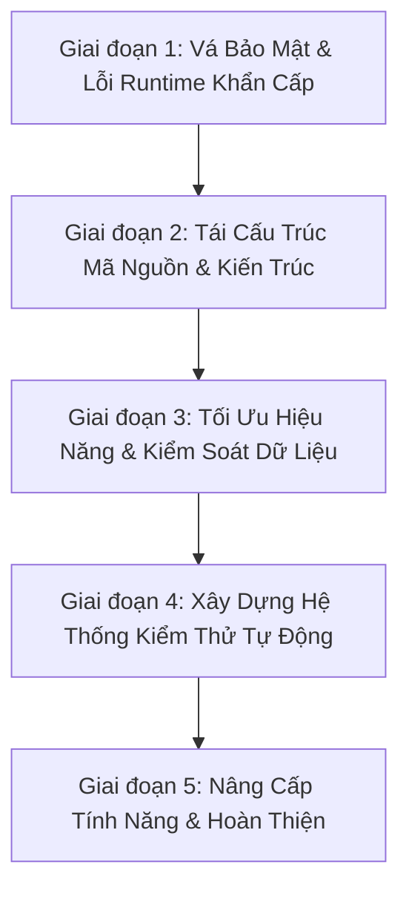

# 📋 Kế Hoạch Nâng Cấp Toàn Diện Dự Án (Master Upgrade Plan)

Tài liệu này là **kế hoạch tổng thể (Master Plan)** tổng hợp toàn bộ các vấn đề kỹ thuật, lỗi tiềm ẩn, lỗ hổng bảo mật và các hạng mục cần tái cấu trúc (refactoring) của dự án **School Medical Management System**.

Từ kế hoạch tổng thể này, khi bắt đầu thực hiện từng giai đoạn, chúng ta sẽ trích xuất thành các file kế hoạch chi tiết độc lập trong thư mục `docs/plans/` (ví dụ: `01-critical-security-and-bugs.md`, `02-architecture-refactoring.md`,...).

---

## 🎯 Mục Tiêu Tổng Thể (Objectives)

1. **Bảo mật tuyệt đối (Security-First):** Loại bỏ 100% các lỗ hổng chiếm quyền tài khoản (Account Takeover), IDOR, lộ thông tin nhạy cảm và kích hoạt lại cơ chế phòng chống CSRF.
2. **Loại bỏ lỗi tiềm ẩn (Bug-Free Runtime):** Sửa dứt điểm các lỗi runtime Hibernate (`MultipleBagFetchException`), race condition OTP và lỗi đệ quy `@Data`.
3. **Kiến trúc chuẩn mực (Clean Architecture):** Tái tổ chức package, khử phụ thuộc vòng (`@Lazy`), sửa lỗi chính tả, dọn dẹp code thừa.
4. **Hiệu năng & Khả năng mở rộng (Performance & Scalability):** Tối ưu hóa batch insert khi gửi lịch khám cho hàng trăm học sinh, hỗ trợ lọc thống kê linh hoạt theo năm.
5. **Chất lượng được chứng thực (Test Coverage):** Xây dựng bộ kiểm thử tự động (Unit & Integration Tests) bảo vệ toàn bộ nghiệp vụ quan trọng.

---

## 🗺️ Lộ Trình Triển Khai 5 Giai Đoạn (Phased Roadmap)

---

## 📌 CHI TIẾT CÁC HẠNG MỤC CẦN SỬA THEO GIAI ĐOẠN

### 🔴 Giai Đoạn 1: Vá Các Lỗ Hổng Bảo Mật & Lỗi Runtime Nghiêm Trọng *(Đã Hoàn Thành - 100%)*
> *Mục tiêu: Đưa ứng dụng về trạng thái an toàn, không thể bị hack tài khoản và không bị crash khi người dùng sử dụng.*

- [x] **1.1. Vá lỗ hổng Chiếm quyền tài khoản (Account Takeover / Broken Authentication):** Đã triển khai `PasswordResetToken` (UUID, 5 phút), yêu cầu xác thực OTP trước khi đổi mật khẩu và tự hủy sau khi dùng.
- [x] **1.2. Bảo vệ thông tin đăng nhập nhạy cảm (Hardcoded Credentials):** Đã chuyển credentials email và CSDL sang biến môi trường trong `application.properties`, thêm `.env` và `application-dev.properties` vào `.gitignore`.
- [x] **1.3. Kích hoạt lại CSRF Protection & Chuẩn hóa HTTP Methods:** Đã chuyển các endpoint xóa (`deleteUser`, `deleteHealthRecord`) sang `@PostMapping` và cập nhật form Thymeleaf tương ứng.
- [x] **1.4. Vá lỗ hổng phân quyền cấp đối tượng (IDOR / Broken Object-Level Authorization):** Đã bổ sung kiểm tra phụ huynh chỉ được xóa hồ sơ và chỉ được gửi thuốc cho con của chính mình.
- [x] **1.5. Nâng cấp cơ chế OTP trong `OtpService`:** Đã chuyển sang `SecureRandom`, 6 chữ số, thời hạn 3 phút, hủy mã ngay khi dùng (chống Replay Attack).
- [x] **1.6. Sửa lỗi `MultipleBagFetchException` trong Hibernate:** Đã chuyển `medicineUsed` và `supplyUsed` trong `MedicalEvent.java` sang `Set` và cập nhật các luồng stream trong `MedicalEventService.java`.

---

### 🟡 Giai Đoạn 2: Tái Cấu Trúc Mã Nguồn & Kiến Trúc (Architecture & Cleanup) *(Đã Hoàn Thành - 100%)*
> *Mục tiêu: Đưa mã nguồn về đúng chuẩn thiết kế phần mềm, dễ đọc, dễ bảo trì, sạch sẽ.*

- [x] **2.1. Phân bổ lại Package Controller:**
  - Đã chuyển `NurseHealthRecordController`, `MedicineController`, `MedicalSupplyController`, `MedicalEventController` sang `com.medical.schoolMedical.controller.schoolNurse`.
  - Đã chuyển `HealthRecordController` sang `com.medical.schoolMedical.controller.parent`.
  - Đã chuyển `ManagerController` sang `com.medical.schoolMedical.controller.manager`.
  - Đã xóa các file cũ thừa trong `controller/user`.
- [x] **2.2. Sửa lỗi chính tả (Typo) Repository:**
  - Đã đổi tên `ParentRepositoty.java` thành `ParentRepository.java` và cập nhật toàn bộ `UserService`, `ParentService`, `StudentService`, `StatisticsService`.
- [x] **2.3. Khử phụ thuộc vòng (Circular Dependencies):**
  - Đã loại bỏ `@Lazy` và các dependency thừa (`healthCheckScheduleService`, `healthCheckRecordService`) trong `HealthCheckConsentService.java` bằng cách gọi trực tiếp `HealthCheckScheduleRepository`.
- [x] **2.4. Dọn dẹp mã nguồn thừa (Dead Code Hygiene):**
  - Đã xóa file thử nghiệm `Trangchutamthoi.java`.
- [x] **2.5. Thay thế `@Data` trên JPA Entities:**
  - Đã chuyển toàn bộ 21 Entity từ `@Data` sang `@Getter`, `@Setter`, `@NoArgsConstructor`, `@AllArgsConstructor` (và `@Builder.Default` khi cần) để ngăn chặn lỗi đệ quy `hashCode`/`toString` và lỗi tracking của Hibernate.
- [x] **2.6. Chuẩn hóa mã lỗi trong `ErrorCode`:**
  - Đã đổi `CHECK_DATE_INVALID` sang `ERR048` (tránh trùng với `STUDENT_NOT_FOUND` - `ERR057`).
  - Đã đổi `VACCINATION_SCHEDULE_NOT_EXISTS` sang `ERR068` (tránh trùng với `HEALTH_CHECK_SCHEDULE_NOT_EXISTS` - `ERR059`).

---

### 🟢 Giai Đoạn 3: Tối Ưu Hiệu Năng & Kiểm Soát Dữ Liệu (Performance & Validation)
> *Mục tiêu: Đảm bảo hệ thống chạy nhanh, chịu tải tốt khi thao tác dữ liệu lớn và chặn đứng dữ liệu rác từ đầu vào.*

- [ ] **3.1. Tối ưu hóa gửi lịch hàng loạt (Batch Processing):**
  - **Hiện trạng:** [HealthCheckConsentService.java:105-112](file:///d:/Old_Project/School_Medical_Management_System/School-Medical-Management-System/src/main/java/com/medical/schoolMedical/service/HealthCheckConsentService.java#L105-L112) lưu từng consent trong vòng `for`, không có `@Transactional`.
  - **Giải pháp:** Thêm `@Transactional`, thu thập toàn bộ consent vào `List` và gọi `healthCheckConsentRepository.saveAll(consents)`.
- [ ] **3.2. Linh hoạt hóa năm thống kê:**
  - **Hiện trạng:** [AdminController.java:49](file:///d:/Old_Project/School_Medical_Management_System/School-Medical-Management-System/src/main/java/com/medical/schoolMedical/controller/admin/AdminController.java#L49) đang fix cứng năm `2025`.
  - **Giải pháp:** Cho phép nhận `year` từ `@RequestParam(required = false)`, mặc định lấy `Year.now().getValue()`.
- [ ] **3.3. Chuẩn hóa Validation toàn diện:**
  - Áp dụng Bean Validation (`@NotBlank`, `@NotNull`, `@Min`, `@Max`, `@Email`, `@Size`) cho toàn bộ DTO tiếp nhận dữ liệu từ Form.
  - Sử dụng `@Valid` hoặc `@Validated` tại tất cả các phương thức Controller.

---

### 🔵 Giai Đoạn 4: Xây Dựng Hệ Thống Kiểm Thử Tự Động (Automated Testing)
> *Mục tiêu: Đạt tỷ lệ bao phủ kiểm thử (Test Coverage) > 75%, đảm bảo không bị lỗi hồi quy (Regression).*

- [ ] **4.1. Unit Tests cho Service Layer:**
  - `UserServiceTest`: Kiểm tra đăng ký, đăng nhập, mã hóa mật khẩu.
  - `OtpServiceTest`: Kiểm tra sinh mã ngẫu nhiên, xác thực đúng/sai, kiểm tra hết hạn.
  - `HealthCheckConsentServiceTest`: Kiểm tra luồng gửi phiếu đồng ý, phê duyệt và từ chối.
  - `MedicalEventServiceTest`: Kiểm tra trừ kho thuốc/vật tư khi xảy ra sự cố y tế.
- [ ] **4.2. Integration Tests cho Security & Controller:**
  - Kiểm tra phân quyền truy cập: Parent không được vào URL của Nurse/Admin, Anonymous không được vào URL riêng tư.
  - Kiểm tra endpoint Reset Password đảm bảo không bị bypass.

---

### 🟣 Giai Đoạn 5: Nâng Cấp Tính Năng & Hoàn Thiện (Enhancements & Polish)
> *Mục tiêu: Đưa dự án lên tầm hoàn chỉnh, sẵn sàng triển khai thực tế.*

- [ ] **5.1. Xuất báo cáo (Export PDF / Excel):**
  - Tích hợp Apache POI hoặc iText để xuất phiếu khám sức khỏe định kỳ và sổ theo dõi tiêm chủng ra file Excel / PDF cho phụ huynh và nhà trường.
- [ ] **5.2. Hệ thống thông báo thời gian thực (In-App Notifications):**
  - Hiển thị chuông thông báo trực tiếp trên giao diện khi phụ huynh có phiếu khám/tiêm mới cần xác nhận.
- [ ] **5.3. Docker hóa & Cấu hình CI/CD:**
  - Viết `Dockerfile` và `docker-compose.yml` (chạy đồng thời Spring Boot App và MySQL).
  - Thiết lập GitHub Actions tự động build và chạy test khi có commit mới.

---

*Tài liệu này được lưu tại `docs/plans/master-upgrade-plan.md` và sẽ là kim chỉ nam trong suốt quá trình phát triển dự án.*
